<h1 align="center">Greg Goodrem Milestone Project 4</h1>
<h2 align='center'>London Omnibus Traction Society Website</h2>
 

This project is the first step in creating a fully functional website with capabilities to have products both sold and to sign up to the annual memberships. This website is constructed with my knowledge level of HTML, CSS, Python, Javascript, Django, Webhooks and API. 

The overall goal of the website is to build an annual subscription membership. The other main feature is to sell the many other publications that are being sold by LOTS.

The original website hasn't been updated properly since 2002 so the third and fundamental purpose is to revamp and make it much more modern and functional.

Members currently have to download and print an order form for publications and then they send their order to the Society. The idea is to change this into a website with sales ability so that it helps both the Society to sell more publications and also the customer receiving their products far quicker due to a more streamline website experience.

[View the live project here.](https://lots-project.herokuapp.com/)

<h2 align="center">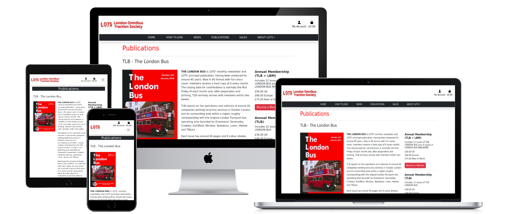</h2>

## Contents

-   ### [User Experience](#ux)
-   ### [Research](#research)
-   ### [Design Process](#design)
-   ### [Wireframe Outlines](#wireframes)
-   ### [Responsive Design Features](#responsive)
-   ### [Future Features](#future)
-   ### [Technologies used](#tech)
-   ### [Frameworks, Libraries & Programs Used](#frameworks)
-   ### [Credits](#credit)
-   ### [Testing & links](#testing)
-   ### [Errors and Bugs](#errors)
-   ### [Personal Conclusion](#conclusion)

***
<a name='ux'/>

## User Experience (UX and UI) 
    
### User Profile

- The profile of the users of this website are generally as follows:
    -   People that grew up in a period of time transportation was more prevalent(so over 55).
    -   More commonly to be male.
    -   Have used the old website & still use cheques.
    -   Often well-informed and knowledgeable about the technical and historical aspects of buses and public transportation.
    -   More likely to be found in urban areas where public transportation is a significant part of daily life.

### User Profile Impact
    
-   The world is changing rapidly and the automation of lots of public & private services means they are more likely to start using the website over the old way of sending a cheque.
-   The option of the old way can be included into the new website however with the intention to phase the old way of working out. 

### Initial User Experience
- The user is initially looking for 1 of 3 things:
    -   News from the society.
    -   Annual membership for The Bus Magazine or London Bus Magazine
    -   Buying publications about Buses
-   I would expect the people using this website being semi regular visitors to the old website.
-   The current members will be encouraged to use the new site so the renewals of membership is far easier.
-   The current members will have a new means of purchasing their other publications. 

 
<a name='research'/>

##  Research  

The original website has been established for over 20 years and the brand itself has been around for almost 60 years.

There are many magazines websites that deal with Buses and transportation these are some of them:

    

I wanted to explore a solution to the very heavily paperwork based industry when it comes to physiotherapy and sports therapy. I personally have experienced as client and also very much understand the role of the therapist as I have done a Sports Massage course.
Reaching out to active therapists I found that a lot of therapists still use paper based systems to collect this information and also when relaying the aftercare information. Not all therapists give advice sheets with detailed examples of the exercises a person should do to help continue injury recovery after a treatment. 
I found their are few treatment apps that include the client as the focus for outputting information to. A lot of the applications available such as Vagaro, Pabau, Noterro among others focus on the therapist souly being the user. 

-   [Omnibus Magazine](https://www.omnibus-society.org/omnibus-magazine) - Subscriptions and back issues are available. I think the website looks clean and well informed however the route to getting a membership is very slow and could be less complicated.
-   [Buses Magazine](https://www.keybuses.com/subscribe-now) - I think the website looks good and looks professional however it does only sell its own publications and not other organisations. It also has different periods of purchase such as quarterly, bi annually, annually and also back issues. 
-   [Classic Bus](https://www.classicbusmag.co.uk/subscriptions) - This website offers sales of annual memberships, back issues and also digital versions. Website looks good and easy to navigate. It is a very basic site. 
-   [On The Buses](https://shop.kelsey.co.uk/on-the-buses-magazine) - Magazines sold through Kelsey media with back issues monthly, annual or digital subscriptions.
-   [Buses Worldwide](https://www.magzter.com/GB/CPUK-Print-Publishing-Ltd/Buses-Worldwide/Automotive/) - This magazine is sold through Magzter with back issues, annual and monthly subscriptions with a digital subscription optional.
-   [LOTS](http://www.lots.org.uk) - Established for 59 years the society has been producing over a thousand different magazines through the variety of publications they provide. The website as it stands is very old with very little interactivity. It is still being updated on the news page fairly regularly with various information applicable to their audiance.

-   ### Research Analysis
    It appears there are a lot of different Bus magazines out there for which they all cover various areas of interest to the Bus enthiuiastsf. It clearly is a very niche sector and from talking also to some of the people running LOTS it is clear that they are suffering from the society membership dwindling. The hope of getting more memberships from the website being setup is vital for future developments with the ever decreasing use of cheques which a lot of members are still using. The reoccuring direct debit will help them to not lose customers in the long run as the DD will continue until it is cancelled without the need to send out renewal letters and spending money on letters etc.
    
     
    
## Design 
-   I opted to use Bootstrap for this website as it is a well known framework and you can create professional looking websites. The style I was able to come up with based on talks with the members of the society. I'll cover all aspects of design in the sections below however please have a look at the new pages compaired to the original website that was created back in 2002.

One of the main instructions from the London Omnibus Traction Society was that they wanted to keep the website quite simple and not to change too much. The main reasoning was that the members that would use the site don't like too much change.

|   |   |
|---|---|
|<h2>New Index Page</h2>|<h2>Old Index Page</h2>|
||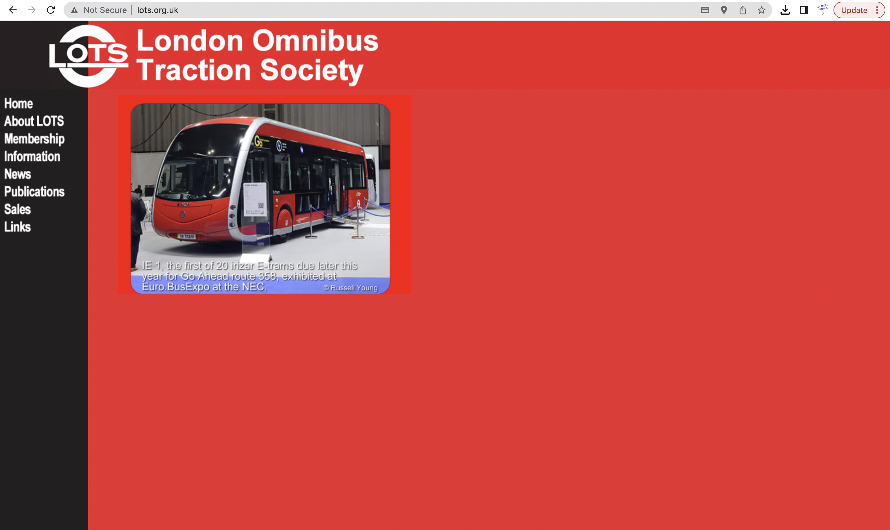|
|<h2>New Membership Page</h2>|<h2>Old Membership Page</h2>|
||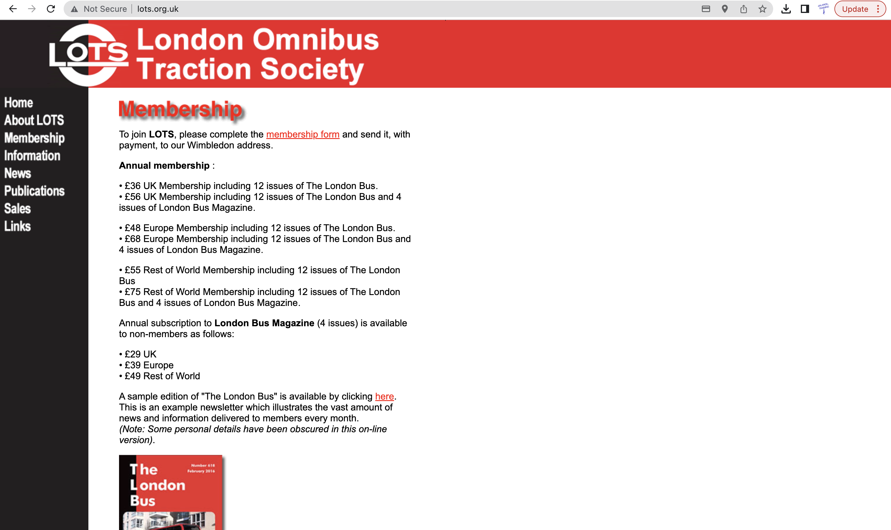|
|<h2>New News Page</h2>|<h2>Old News Page</h2>|
|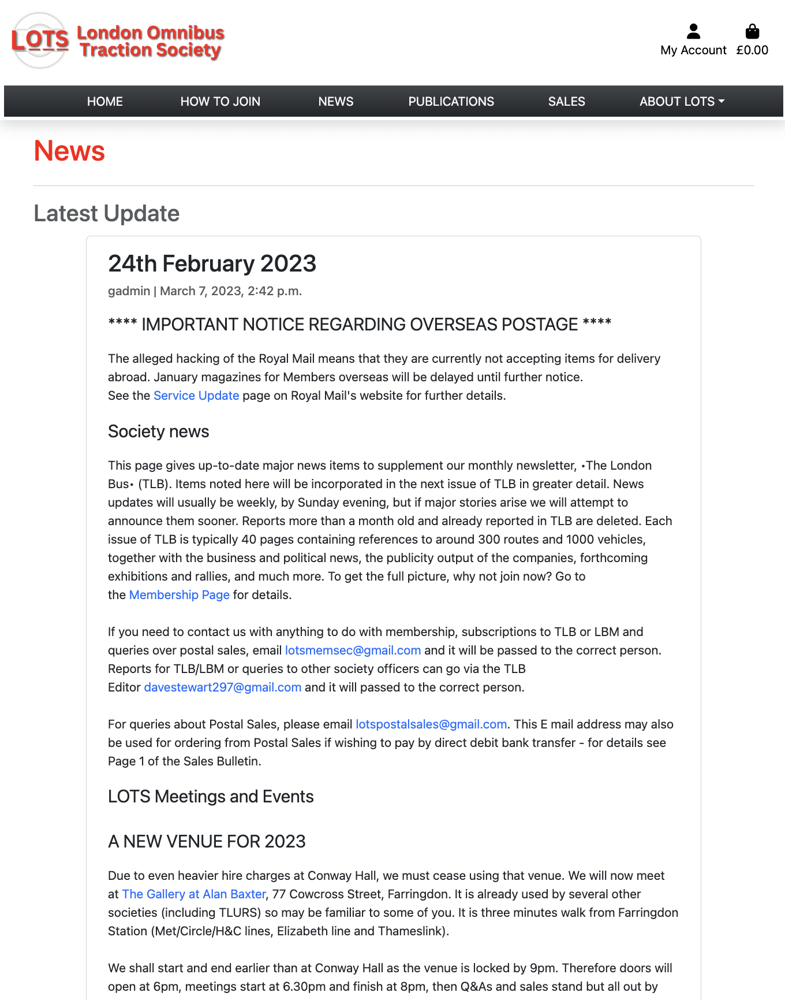|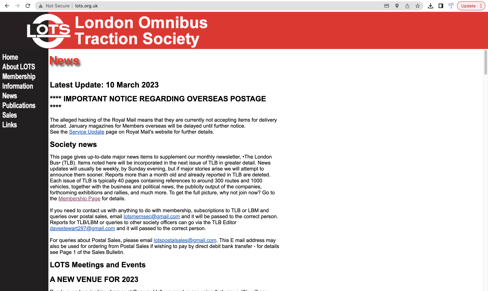|
|<h2>New Publications Page</h2>|<h2>Old Publications Page</h2>|
|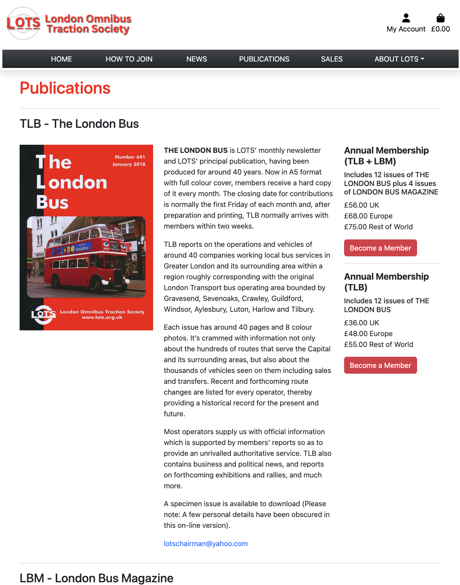||
|<h2>New Sales Page</h2>|<h2>Old Sales Page</h2>|
|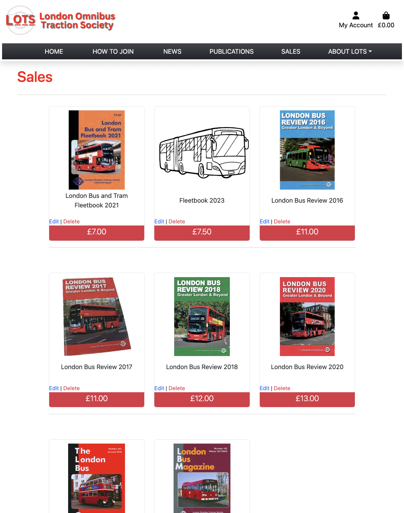|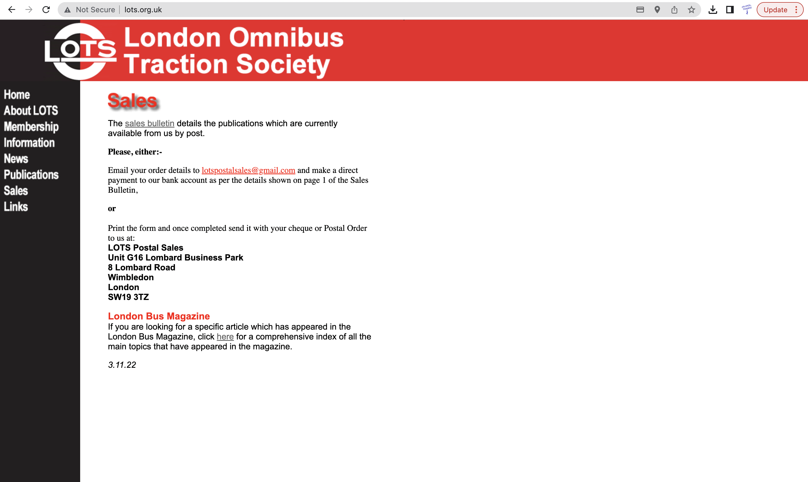|
|<h2>New About Page</h2>|<h2>Old About Page</h2>|
|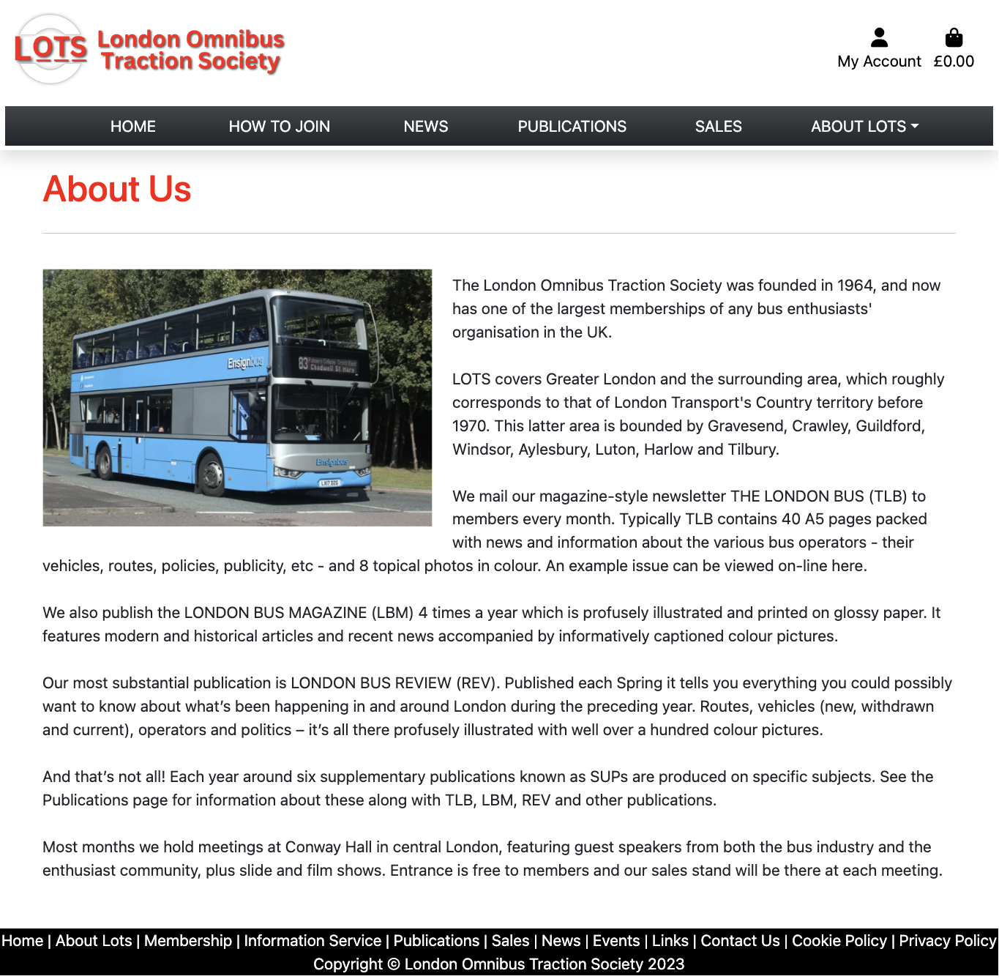||
|<h2>New Links Page</h2>|<h2>Old Links Page</h2>|
||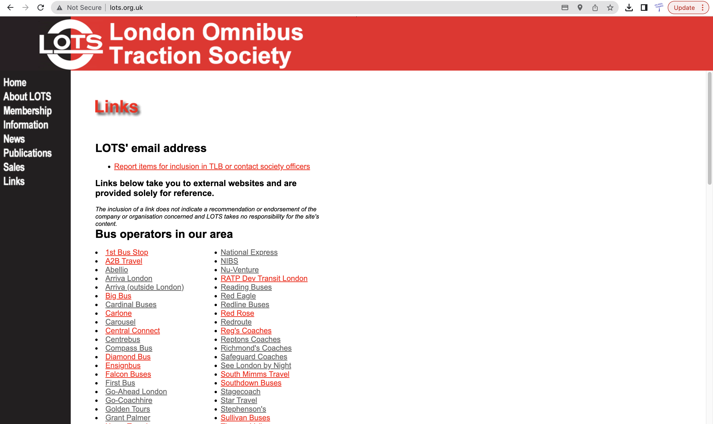|
|<h2>New Contact Page</h2>|<h2>Old Info Page</h2>|
|||

### Brand Logo
-   The Brand logo was quite pixelated when I first started looking at the original website and decided it was worth tweaking it and creating a newer clearer logo. I used Canva to redesign it and give it a couple of different designs. I created a smaller logo for when the display is responsive and the width gets smaller to only show the basic smaller logo seen below.

|   |   |
|---|---|
|New Redesigned Logo|Old Logo|
|||
|New Redesigned Alternative Red Logo|   |
||   |
|Smaller Redesigned Logo|   |
|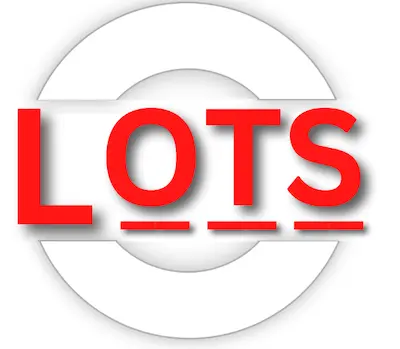|   |

### Colour Scheme
-   The main colours used all associated with the original website and the different logos that the society has used in the past. I tried to incorporate these into the menus and the drop down menus and throughout the site.

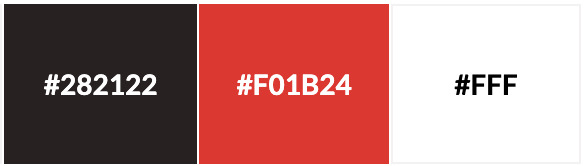

### Typography
-   To conform with the simplistic request from the society I have used the more common professional fonts such as Arial, Helvetica and sans-serif. These will help the older users of the website be able to clearly read the text and feel comfortable.

### Imagery
-   The pictures used on this website have all come from the London Omnibus Traction Society. The majority of the imagery is from the publications themselves however I have also used some pictures of single buses for the sliders.

### Database
-   Django officially supports Postgres, My SQL, Oracle and many more. The top of the list was Postgres and so I continued to use this as it was already established in the backend of Django. If you look at the schema below you will see the fundamental differences in the colour schemes used to identify the different parts that are being used in this project.
    -   Green - This identifies the Django created backend this also includes the news posting part of the site that I created.
    -   Blue - This is the Django admin and installed admin interface theme manager which was installed.
    -   Orange - This is the main schema structure for products and checkouts with the use of the profiles as an entry point.

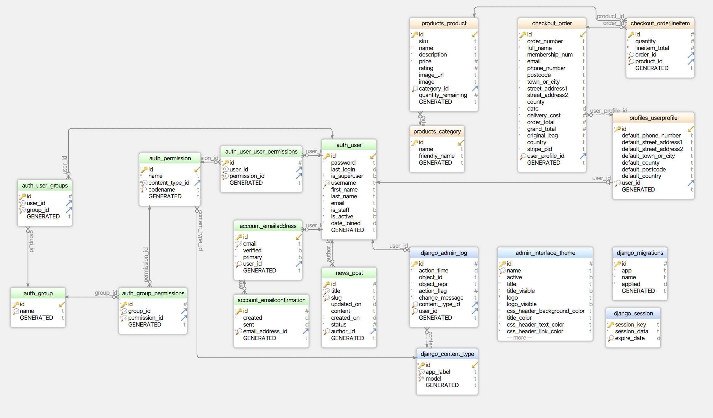 

 
<a name='wireframes'/>

## Wireframes 

-   Home Screen Wireframe - [View](https://milestone3-greg-goodrem.herokuapp.com/static/images/readme_images/home.png)
-   Login Screen Wireframe - [View](https://milestone3-greg-goodrem.herokuapp.com/static/images/readme_images/login.jpg)
-   Register Screen Wireframe - [View](https://milestone3-greg-goodrem.herokuapp.com/static/images/readme_images/register.jpg)
-   Add Client Screen Wireframe - [View](https://milestone3-greg-goodrem.herokuapp.com/static/images/readme_images/add_client.jpg)
-   Add Treatment Screen Wireframe - [View](https://milestone3-greg-goodrem.herokuapp.com/static/images/readme_images/add_treatment.jpg)
-   Edit Client Screen Wireframe - [View](https://milestone3-greg-goodrem.herokuapp.com/static/images/readme_images/edit_client.jpg)
-   Edit Treatment Screen Wireframe - [View](https://milestone3-greg-goodrem.herokuapp.com/static/images/readme_images/edit_treatment.png)
-   Treatments Screen Wireframe - [View](https://milestone3-greg-goodrem.herokuapp.com/static/images/readme_images/treatments.jpg)
-   Manage Clients Screen Wireframe - [View](https://milestone3-greg-goodrem.herokuapp.com/static/images/readme_images/manage_clients.jpg)
-   Report Screen Wireframe - [View](https://milestone3-greg-goodrem.herokuapp.com/static/images/readme_images/report.jpg)

 
<a name='responsive'/>

## Responsive Design Features 
-   The App has been made to be responsive on varying sized screens.
-   The App will resize from the screen of a mobile phone all the way to a full desktop display.
-   Its intended use is for the therapist to generally use a computer or tablet device to input informaion and the end user (Client) to review on their phones.
-   Even though the intended use is as stated it can still be used on a mobile by a therapist if required.
-   The treatment advice and notes are immediately available to the client after their session.
-   The treatments and clients can be edited and deleted. The delete function has a modal setup so people don't accidently delete treatments or clients.  
-   The reports page keeps track of trends with overall numbers of clients and treatments on different areas oof the body.
-   Individually you can review treatments of clients and how many they've had on different areas of the body. This can help out for returning clients and reviewing previous sessions.
-   The booking system has been embeded using an iframe and automatically filling the name and email data from the users own information. 
-   The booking system automatically emails out to the client confirmation of appointment.

         
<a name='future'/>

## Future Features 
-   I think adding more advice sheets with video links and instructionals would be a great feature. Currently I have used Knee, Back, Shoulder and a general one advice sheet so I would actually break this down further to more specific injuries as well. For example if someone comes in with a shoulder injury the recovery advice can vary from being very general to being very specific e.g. If someone has an anterior injury of the deltoid or a injury to the rotator cuff the advice would be very different but are both in the shoulder area.
-   Having a time limited access to content could really help injury recovery and help promote a client to come back if at the end of that period if they haven't seen any progress. After all the client could try and do the recovery advice at another time and potentially make it worse because its a different type of injury. It could also be a completely different type of medical issue.
-   The ability to see the time of the next appointment with the therapist in the app itself and also the ability to pay for services in the app. This would be good for client tracking.
-   I could also include a communications system within the app so the therapist can respond and help injury recovery more thoroughly going forward.
 
<a name='tech'/>

## Technologies used 
-   [HTML5](https://en.wikipedia.org/wiki/HTML5)
-   [CSS3](https://en.wikipedia.org/wiki/Cascading_Style_Sheets)
-   [Javascript](https://en.wikipedia.org/wiki/javascript)
-   [Python](https://en.wikipedia.org/wiki/Python_(programming_language))
-   [Jinja](https://en.wikipedia.org/wiki/Jinja_(template_engine))

 
<a name='frameworks'/>

## Frameworks, Libraries & Programs Used 

- [Google Fonts:](https://fonts.google.com/)     
    - Google fonts were used to import the 'Roboto' font into the style.css file which is used on all pages throughout the project.
- [Font Awesome:](https://fontawesome.com/)
    - Font Awesome was used on all pages throughout the website to add icons for aesthetic and UX purposes.
- [Git](https://git-scm.com/)
    - Git was used for version control by utilizing the terminal to commit to Git and Push to GitHub.
- [GitHub:](https://github.com/)
    - GitHub is used to store the projects code after being pushed from Git.
- [Wondershare Mockitt:](https://balsamiq.com/)
    - Balsamiq was used to create the wireframes during the design process.
- [EmailJS](https://www.emailjs.com/)
- I used EmailJS to enable free emailing to the therapist on the home page.
- [GoCardless]
- []

- [MongoDB](https://www.mongodb.com/)
    - I used MongoDB as the database for storing information gathered in the app.

     
    <a name='credit'/>

## Credits

I got some assistance from the Code institute tutors when I was using PostgreSQL but was really helpful in helping me identify the why as to thing. Also my mentor was able to help me identify a few changes in regards to MongoDB which helped me create a cascade style delete function even though this is a non-relational database.

 
<a name='testing'/>

## Testing 

The website has been continually tested manually and also with defensive coding included in the routes.py as well as some safeguarding delete functions created to protect the data from accidental deletion.

I've also tested the site on several different devices with different types of screen sizes for responsiveness.     

The W3C Markup Validator and W3C CSS Validator Services were used to validate every page of the project to ensure there were no syntax errors in the project.

- [W3C Markup Validator](https://validator.w3.org/nu/?doc=https%3A%2F%2Fmilestone3-greg-goodrem.herokuapp.com%2Fhome) - Results - No Errors or Warnings on any page.
- [W3C CSS Validator](https://jigsaw.w3.org/css-validator/validator?uri=https%3A%2F%2Fmilestone3-greg-goodrem.herokuapp.com%2Fstatic%2Fcss%2Fstyle.css&profile=css3svg&usermedium=all&warning=1&vextwarning=&lang=en) - Results No Errors

    ### Lighthouse Reports 

| Pages  |  Mobile | Desktop |
|---|---|---|
| Home  |   |   |
| Manage Clients |   |   |
| Add Client  |    |   |
| Edit Client |   |   |
| Add Treatment  |   |   |
| Edit Treatment  |   |   |
| Treatments  |   |   |
| Report  |   |   |
| Login  |   |   |
| Register |   |   |

-   [Wave Report](https://wave.webaim.org/report#/https://milestone3-greg-goodrem.herokuapp.com/home) - There are 4 alerts which relate to Table layout (which is the timetable of availability), 2 redundant links which I want to keep on the page and a 1st level heading alert. All of these alerts are absolutely fine for my requirements of the pages.
-   [ESLint](https://eslint.org/play/#eyJ0ZXh0IjoiLy9FbGVtZW50cyByZWxhdGVkIHRvIHRoZSBiYXNpYyB2aXN1YWwgc2V0dXAgYW5kIGludGVyYWN0aW9uXG4vKmdsb2JhbCBkb2N1bWVudCBIb3dsIGNvbnNvbGUgc2V0VGltZW91dCBtb2R1bGUgKi9cbmNvbnN0IE5VTUJFUlMgPSBkb2N1bWVudC5nZXRFbGVtZW50QnlJZCgnbnVtYmVycycpO1xuY29uc3QgRklOQUxfU0NPUkUgPSBkb2N1bWVudC5nZXRFbGVtZW50QnlJZCgnc2NvcmUnKTtcbmNvbnN0IFBFUkZFQ1RfU0NPUkUgPSBkb2N1bWVudC5nZXRFbGVtZW50QnlJZCgncGVyZmVjdFNjb3JlJyk7XG5jb25zdCBTQ09SRV9TQ1JFRU4gPSBkb2N1bWVudC5nZXRFbGVtZW50QnlJZCgnc2NvcmVzY3JlZW4nKTtcbmNvbnN0IFBSRVNUQVJUID0gZG9jdW1lbnQuZ2V0RWxlbWVudEJ5SWQoJ3ByZXN0YXJ0Jyk7XG5jb25zdCBHQU1FX1NDT1JFID0gZG9jdW1lbnQuZ2V0RWxlbWVudEJ5SWQoJ2dhbWVTY29yZScpO1xuY29uc3QgTlVNUyA9IGRvY3VtZW50LnF1ZXJ5U2VsZWN0b3JBbGwoJy5udW1zIHNwYW4nKTtcbmNvbnN0IENPVU5URVIgPSBkb2N1bWVudC5xdWVyeVNlbGVjdG9yKCcuY291bnRlcicpO1xuY29uc3QgUkVQTEFZID0gZG9jdW1lbnQucXVlcnlTZWxlY3RvcignI3JlcGxheScpO1xuY29uc3QgVEFSR0VUUyA9IGRvY3VtZW50LnF1ZXJ5U2VsZWN0b3JBbGwoJy50YXJnZXQnKTtcbmNvbnN0IFRBUkdFVF8xID0gZG9jdW1lbnQuZ2V0RWxlbWVudEJ5SWQoJ3RhcmdldG9uZScpO1xuY29uc3QgVEFSR0VUXzIgPSBkb2N1bWVudC5nZXRFbGVtZW50QnlJZCgndGFyZ2V0dHdvJyk7XG5jb25zdCBUQVJHRVRfMyA9IGRvY3VtZW50LmdldEVsZW1lbnRCeUlkKCd0YXJnZXR0aHJlZScpO1xuY29uc3QgTUlTU0VEID0gZG9jdW1lbnQucXVlcnlTZWxlY3RvcignLmNvbnRhaW5lcicpO1xuY29uc3QgQ0VOVEVSUyA9IGRvY3VtZW50LnF1ZXJ5U2VsZWN0b3JBbGwoJy5jZW50ZXJ0YXJnZXQnKTtcbmNvbnN0IFBFUkZFQ1QgPSBkb2N1bWVudC5xdWVyeVNlbGVjdG9yKCcucGVyZmVjdCcpO1xuY29uc3QgU0hPVF9UQUxMWV9JRCA9IGRvY3VtZW50LnF1ZXJ5U2VsZWN0b3IoJyNzaG90VGFsbHlJRCcpO1xuY29uc3QgU0hPVF9UQUxMWV9DVVJSRU5UID0gZG9jdW1lbnQucXVlcnlTZWxlY3RvcignI3Nob3RUYWxseUN1cnJlbnQnKTtcbmNvbnN0IFBFUkZFQ1RfVEFMTFlfSUQgPSBkb2N1bWVudC5xdWVyeVNlbGVjdG9yKCcjcGVyZmVjdFRhbGx5Jyk7XG5jb25zdCBUQVJHRVRfVEFMTFlfSUQgPSBkb2N1bWVudC5xdWVyeVNlbGVjdG9yKCcjdGFyZ2V0VGFsbHknKTtcbmNvbnN0IEJVTExFVF9IT0xFUyA9IGRvY3VtZW50LnF1ZXJ5U2VsZWN0b3JBbGwoJy5yaXBwbGUnKTtcbmNvbnN0IElOU1RSVUNUSU9OX1NUQVJUID0gZG9jdW1lbnQuZ2V0RWxlbWVudEJ5SWQoJ2luc3RydWN0aW9uU3RhcnQnKTtcbi8vQWN0aXZlIHZhcmlhYmxlcyB0aHJvdWdob3V0IGdhbWVcbmxldCBwb3NpdGlvbk51bSA9IDU7XG5sZXQgcGVyZmVjdFRhbGx5ID0gMDtcbmxldCBzaG90VGFsbHkgPSAwO1xubGV0IHRhcmdldFRhbGx5ID0gMDtcblxuLyogVGhlc2UgYXJlIHRoZSBzb3VuZCBlZmZlY3RzIHRoYXQgSSdtIHVzaW5nIGluIGNvbmp1Y3Rpb24gd2l0aCBIb3dsZXIganMgd2hpY2ggZW5hYmxlc1xubWUgdG8gaGF2ZSAyIGRpZmZlcmVudCB0eXBlcyBvZiBzb3VuZCBlZmZlY3QgMSBmb3IgZmlyaW5nIGFuZCBoaXR0aW5nIGEgdGFyZ2V0IGFuZCB0aGUgXG5vdGhlciBmb3IgbWlzc2luZyB0aGUgdGFyZ2V0ICovXG52YXIgc2Z4ID0ge1xuICAgIHNob3Q6IG5ldyBIb3dsKHtcbiAgICBzcmM6IFtcImh0dHBzOi8vY29kZWdyZWcxLmdpdGh1Yi5pby9taWxlc3RvbmVfcHJvamVjdDIvZ3Vuc2hvcnQubXAzXCJdLFxuICAgIGF1dG9wbGF5OiB0cnVlXG59KSxcbiAgICBtaXNzOiBuZXcgSG93bCh7XG4gICAgc3JjOiBbXCJodHRwczovL2NvZGVncmVnMS5naXRodWIuaW8vbWlsZXN0b25lX3Byb2plY3QyL3JpY29jaGV0Lm1wM1wiXSxcbiAgICBhdXRvcGxheTp0cnVlXG59KX07XG5cbi8qIFRoZSBldmVudCBsaXN0ZW5lcnMgbGlzdGVkIGhlcmUgYXJlIHVzZWQgZm9yIHRoZSBzdGFydGluZywgcmVwbGF5aW5nIG9mIHRoZSBtYWluIGdhbWVcbmFuZCBhbHNvIHRoZSBkaWZmZXJlbnQgZWZmZWN0cyBvbiB0YXJnZXRzOiBcbiAgICBUYXJnZXQxIGJlaW5nIGhpdFxuICAgIFRhcmdldDIgYmVpbmcgaGl0XG4gICAgVGFyZ2V0MyBiZWluZyBoaXRcbiAgICBUYXJnZXQgbWlzc2VkXG4gICAgQ2VudGVyL1BlcmZlY3QgaGl0IGlzIGFjaGlldmVkIG9uIGFueSBsZXZlbFxuICAgIGFuZCBmaW5hbGx5IHRoZSBidWxsZXQgaG9sZSBlZmZlY3Qgb24gbWlzc2VkIHRhcmdldHNcbiovXG5QUkVTVEFSVC5hZGRFdmVudExpc3RlbmVyKCdjbGljaycscnVuR2FtZSk7XG5cblJFUExBWS5hZGRFdmVudExpc3RlbmVyKCdjbGljaycsIHJlcGxheSk7XG5cbklOU1RSVUNUSU9OX1NUQVJULmFkZEV2ZW50TGlzdGVuZXIoJ2NsaWNrJywgaW5zdHJ1Y3Rpb25TdGFydCk7XG5cbk1JU1NFRC5hZGRFdmVudExpc3RlbmVyKCdjbGljaycsIG1pc3NlZFNob3QpO1xuXG5UQVJHRVRfMS5hZGRFdmVudExpc3RlbmVyKCdjbGljaycsKCk9PiB7XG4gICAgcG9zaXRpb25OdW0gPSAyNjg7XG4gICAgaW5jcmVtZW50U2NvcmUoMSk7XG4gICAgc2hvdFVwZGF0ZSgpO31cbik7XG5UQVJHRVRfMi5hZGRFdmVudExpc3RlbmVyKCdjbGljaycsKCk9PiB7XG4gICAgcG9zaXRpb25OdW0gPSAyODg7XG4gICAgaW5jcmVtZW50U2NvcmUoMik7XG4gICAgc2hvdFVwZGF0ZSgpO31cbik7XG5UQVJHRVRfMy5hZGRFdmVudExpc3RlbmVyKCdjbGljaycsKCk9PiB7XG4gICAgcG9zaXRpb25OdW0gPSAzMDg7XG4gICAgc2hvdFVwZGF0ZSgpO1xuICAgIGluY3JlbWVudFNjb3JlKDMpO1xufSk7XG4vKiBUaGVzZSBmb3IgbG9vcHMgYXJlIGZvciB3aGVuIHRhcmdldHMgZ2V0IHRhcHBlZC9jbGlja2VkIGFuZCBhIFxuZmlyaW5nIHNvdW5kIGlzIHRvIGJlIGluaXRpYXRlZC4gVGhlIHN0b3BQcm9wYWdhdGlvbiBtYWtlcyBzdXJlIGl0XG5kb2Vzbid0IHN0YXJ0IHRoZSBtaXNzZWQgc2hvdCBldmVudCBsaXN0ZW5lci4gXG5UaGUgc2Vjb25kIGlzIGEgZm9yIGxvb3AgZm9yIHRoZSBkZXRlY3Rpb24gb2YgYSBwZXJmZWN0IHNob3QgYmVpbmcgbWFkZS5cblRoZSB0aGlyZCBpcyB0aGUgdmlzdWFsaXNhdGlvbiBvZiBhIHNob3QgYmVpbmcgbWFkZSBvbiB0aGUgY29udGFpbmVyLiovXG5cblRBUkdFVFMuZm9yRWFjaCgodGFyZ2V0KT0+e1xuICAgIHRhcmdldC5hZGRFdmVudExpc3RlbmVyKCdjbGljaycsIGZ1bmN0aW9uKGUpIHtcbiAgICAgICAgdGFyZ2V0LmNsYXNzTGlzdC50b2dnbGUoJ2FjdGl2ZScpO1xuICAgICAgICBzZnguc2hvdC5wbGF5KCk7XG4gICAgICAgIHRhcmdldFRhbGx5Kys7XG4gICAgICAgIGUuc3RvcFByb3BhZ2F0aW9uKCk7XG4gICAgICAgIGNvbnNvbGUubG9nKCdUYXJnZXQgY2xpY2tlZCcpO1xuICAgICAgICBzZXRUaW1lb3V0KG5ld1Bvc2l0aW9uLCAxMDApO30pO1xufVxuKTtcblxuQ0VOVEVSUy5mb3JFYWNoKChjZW50ZXIpPT57XG4gICAgY2VudGVyLmFkZEV2ZW50TGlzdGVuZXIoJ2NsaWNrJywoKT0+IHtcbiAgICAgICAgaW5jcmVtZW50U2NvcmUoMSk7XG4gICAgICAgIHBlcmZlY3RUYWxseSsrO1xuICAgICAgICBpbmNyZW1lbnRQZXJmZWN0U2NvcmUoKTt9KTtcbn1cbik7XG5cbkJVTExFVF9IT0xFUy5mb3JFYWNoKGhvbGUgPT4ge1xuICAgIGhvbGUuYWRkRXZlbnRMaXN0ZW5lcignY2xpY2snLCBmdW5jdGlvbiAoZSkge1xuICAgIGNvbnN0IFRBUkdFVF9PRkZTRVQgPSBwYXJzZUludCg0KTtcbiAgICBjb25zdCBYID0gZS5jbGllbnRYIC0gVEFSR0VUX09GRlNFVDtcbiAgICBjb25zdCBZID0gZS5jbGllbnRZIC0gVEFSR0VUX09GRlNFVDtcbiAgICBjb25zdCBjaXJjbGUgPSBkb2N1bWVudC5jcmVhdGVFbGVtZW50KCdzcGFuJyk7XG4gICAgY2lyY2xlLmNsYXNzTGlzdC5hZGQoJ2NpcmNsZScpO1xuICAgIGNpcmNsZS5zdHlsZS50b3AgPSBZICsgJ3B4JztcbiAgICBjaXJjbGUuc3R5bGUubGVmdCA9IFggKyAncHgnO1xuICAgIHRoaXMuYXBwZW5kQ2hpbGQoY2lyY2xlKTtcbiAgICBjb25zb2xlLmxvZyhYLFkpO1xuICAgIHNob3RVcGRhdGUoKTtcbiAgICBzZXRUaW1lb3V0KCgpID0+IGNpcmNsZS5yZW1vdmUoKSwgMjAwKTtcbn0pO31cbik7XG5cbi8vVGhpcyBwbGF5cyBhIHJpY29jaGV0IHNvdW5kIGV2ZXJ5dGltZSBhIHNob3QgaXMgbm90IGhpdHRpbmcgYSB0YXJnZXRcbmZ1bmN0aW9uIG1pc3NlZFNob3QoKXtcbiAgICBzZngubWlzcy5wbGF5KCk7XG4gICAgc2Z4Lm1pc3Mudm9sdW1lKDAuNik7XG59XG5cbi8vVGhpcyB3b3JrcyBpbiBjb25qdW5jdGlvbiB3aXRoIHRoZSB0YXJnZXQgYmVpbmcgaGl0IGFuZCB0aGVuIHJlc2V0IGludG8gYSBuZXcgXG4vL3Bvc2l0aW9uIGFsb25nIGl0cyBob3Jpem9udGFsIGF4aXMgZGVwZW5kaW5nIG9uIHdoaWNoIGxldmVsIHRhcmdldCBoYXMgYmVlbiBzdHJ1Y2sgXG5mdW5jdGlvbiBuZXdQb3NpdGlvbigpe1xuICAgIGxldCBhY3RpdmVUYXJnZXQgPSBkb2N1bWVudC5xdWVyeVNlbGVjdG9yKCcudGFyZ2V0LmFjdGl2ZScpO1xuICAgIGFjdGl2ZVRhcmdldC5zdHlsZS5sZWZ0ID0gYCR7KE1hdGguZmxvb3IoTWF0aC5yYW5kb20oKSAqIHBvc2l0aW9uTnVtKSArIDEpfXB4YDtcbiAgICBhY3RpdmVUYXJnZXQuY2xhc3NMaXN0LnRvZ2dsZSgnYWN0aXZlJyk7XG59XG5cbi8qIEJlbG93IGFyZSB0aGUgdHdvIGRpZmZlcmVudCBpbmNyZW1lbnRhdGlvbiBvZiBzY29yZXMuIFRoZSBwZXJmZWN0IHNjb3JlIGlzIHZlcnkgYmFzaWNcbmJ1dCB0aGUgZ2VuZXJhbCBpbmNyZW1lbnRTY29yZSBpbmNvcnBvcmF0ZXMgbnVtYmVycyBiZWluZyBwYXNzZWQgaW50byBpdCBmcm9tIHdoaWNoZXZlciBcbmxldmVsIHRoZSB0YXJnZXRzIGFyZSBoaXQuICovXG5mdW5jdGlvbiBpbmNyZW1lbnRQZXJmZWN0U2NvcmUoKXtcbiAgICBsZXQgb2xkU2NvcmUgPSBwYXJzZUludChkb2N1bWVudC5nZXRFbGVtZW50QnlJZChcInBlcmZlY3RTY29yZVwiKS5pbm5lclRleHQpO1xuICAgIGRvY3VtZW50LmdldEVsZW1lbnRCeUlkKFwicGVyZmVjdFNjb3JlXCIpLmlubmVyVGV4dCA9ICsrb2xkU2NvcmU7XG59XG5cbmZ1bmN0aW9uIGluY3JlbWVudFNjb3JlKHgpe1xuICAgIGlmICh4ID09PSAxKSB7eCA9IDE7XG4gICAgfSBlbHNlIGlmICh4ID09PSAyKSB7eCA9IDI7XG4gICAgfSBlbHNlIHt4ID0gMztcbiAgICB9XG4gICAgbGV0IG9sZFNjb3JlID0gcGFyc2VJbnQoZG9jdW1lbnQuZ2V0RWxlbWVudEJ5SWQoXCJzY29yZVwiKS5pbm5lclRleHQpO1xuICAgIGRvY3VtZW50LmdldEVsZW1lbnRCeUlkKFwic2NvcmVcIikuaW5uZXJUZXh0ID0gb2xkU2NvcmUgKyB4O1xufVxuXG4vKiBCZWxvdyBhcmUgdGhlIG1haW4gZ2FtZSBzdGFydGluZyBhbmQgcmVzdGFydGluZyBmdW5jdGlvbnMuIFxucnVuR2FtZSgpIGlzIHRoZSBpbml0aWFsIGZ1bmN0aW9uIHJlYWR5IHRvIGJlIHN0YXJ0ZWQgYXQgdGhlIHN0YXJ0IG9mIHRoZSBwYWdlIGxvYWQgXG5hbmQgcnVucyBvdGhlciBmdW5jdGlvbnMgZm9yIHRoZSBnYW1lIHRvIGJlIGFjdGl2ZS5cbnJlc2V0RE9NKCkgaXMgdXNlZCB0byByZXNldCB0aGUgRE9NIGFuZCBhbHNvIHRoZSBjb3VudGRvd24gdGltZXIuXG5yZXBsYXkoKSBpcyB1c2VkIGFmdGVyIHRoZSBnYW1lIGhhcyBiZWVuIHJ1biBzbyB0aGF0IHRoZSBzY29yZXMgY2FuIGdvIGJhY2sgdG8gemVybyBcbmFuZCBhbHNvIHRoZSBET00gYmVpbmcgcmVzZXQgdXBvbiB0aGUgbmV4dCBnYW1lIGxvYWQuXG5pbnN0cnVjdGlvblN0YXJ0KCkgaXMgYW4gYWx0ZXJuYXRpdmUgb3B0aW9uIHRvIHJlcGxheSgpIGluY2FzZSBhbnlvbmUgcGxheWluZyBuZWVkcyB0byBcbnJldmlldyB0aGUgaW5zdHJ1Y3Rpb25zIGFnYWluIGhvd2V2ZXIgdGhpbmdzIHN0aWxsIG5lZWQgdG8gYmUgcmVzZXQuXG4qL1xuZnVuY3Rpb24gcnVuR2FtZSgpIHtcbiAgICBwZXJmZWN0VGFsbHkgPSAwO1xuICAgIHNob3RUYWxseSA9IDA7XG4gICAgU0hPVF9UQUxMWV9DVVJSRU5ULmlubmVyVGV4dCA9IHNob3RUYWxseTtcbiAgICB0YXJnZXRUYWxseSA9IDA7XG4gICAgcmVzZXRET00oKTtcbiAgICBzdGFydFNjb3JlKCk7XG4gICAgY29uc3QgSDQgPSBkb2N1bWVudC5xdWVyeVNlbGVjdG9yKCdoNCcpO1xuICAgIEZJTkFMX1NDT1JFLnN0eWxlLmZvbnRTaXplID0gJzY1cHgnO1xuICAgIHJ1bkFuaW1hdGlvbigpO1xuICAgIEg0LmlubmVyVGV4dCA9ICdTSE9PVCEhISc7XG4gICAgTlVNQkVSUy5jbGFzc0xpc3QuYWRkKCdpbicpO1xuICAgIE5VTUJFUlMuY2xhc3NMaXN0LnJlbW92ZSgnaW4nKTtcbiAgICBOVU1CRVJTLmNsYXNzTGlzdC5hZGQoJ291dCcpO1xufVxuXG5mdW5jdGlvbiByZXNldERPTSAoKSB7XG4gICAgQ09VTlRFUi5jbGFzc0xpc3QucmVtb3ZlKCdoaWRlJyk7XG4gICAgQ09VTlRFUi5jbGFzc0xpc3QuYWRkKCdzaG93Jyk7XG4gICAgTlVNUy5mb3JFYWNoKChudW0pID0+IHtcbiAgICAgICAgbnVtLmNsYXNzTGlzdC52YWx1ZSA9ICcnO30pO1xuICAgIE5VTVNbMF0uY2xhc3NMaXN0LmFkZCgnaW4nKTtcbn1cblxuZnVuY3Rpb24gcmVwbGF5KCl7XG4gICAgRklOQUxfU0NPUkUuaW5uZXJUZXh0ID0gJzAnO1xuICAgIFBFUkZFQ1RfU0NPUkUuaW5uZXJUZXh0ID0gJzAnO1xuICAgIFNIT1RfVEFMTFlfQ1VSUkVOVC5pbm5lclRleHQgPSAnMCc7XG4gICAgU0NPUkVfU0NSRUVOLmNsYXNzTGlzdC5hZGQoJ2hpZGRlbnNjb3JlJyk7XG4gICAgU0NPUkVfU0NSRUVOLmNsYXNzTGlzdC5yZW1vdmUoJ3Zpc2libGUnKTtcbiAgICBQRVJGRUNUX1NDT1JFLmNsYXNzTGlzdC5yZW1vdmUoJ2hpZGRlbnNjb3JlJyk7XG4gICAgUEVSRkVDVC5jbGFzc0xpc3QucmVtb3ZlKCdoaWRkZW5zY29yZScpO1xuICAgIHJ1bkdhbWUoKTtcbn1cblxuZnVuY3Rpb24gaW5zdHJ1Y3Rpb25TdGFydCgpe1xuICAgIEZJTkFMX1NDT1JFLmlubmVyVGV4dCA9ICcwJztcbiAgICBQRVJGRUNUX1NDT1JFLmlubmVyVGV4dCA9ICcwJztcbiAgICBTQ09SRV9TQ1JFRU4uY2xhc3NMaXN0LmFkZCgnaGlkZGVuc2NvcmUnKTtcbiAgICBTQ09SRV9TQ1JFRU4uY2xhc3NMaXN0LnJlbW92ZSgndmlzaWJsZScpO1xuICAgIFBFUkZFQ1RfU0NPUkUuY2xhc3NMaXN0LnJlbW92ZSgnaGlkZGVuc2NvcmUnKTtcbiAgICBQRVJGRUNULmNsYXNzTGlzdC5yZW1vdmUoJ2hpZGRlbnNjb3JlJyk7XG4gICAgUFJFU1RBUlQuY2xhc3NMaXN0LnJlbW92ZSgnaGlkZGVuc2NvcmUnKTtcbiAgICBQUkVTVEFSVC5jbGFzc0xpc3QuYWRkKCd2aXNpYmxlJyk7XG59XG5cbi8qIHNob3RVcGRhdGUoKSB1cGRhdGVzIHRoZSBzaG90IHRhbGx5IGluIHRoZSBnYW1lIGFuZCBydW5BbmltYXRpb24oKSBhbGxvd3NcbmZvciB0aGUgc2NvcmUgdG8gYmUgYW5pbWF0ZWQgdXNpbmcgdGhlIENTUyB0cmFuc2Zvcm1hdGlvbnMgYW5kIGNsYXNzZXMgc21vb3RobHlcbm9uY2UgdGhlIGdhbWUgaGFzIGJlZ3VuLlxuKi9cbmZ1bmN0aW9uIHNob3RVcGRhdGUoKXtcbiAgICBzaG90VGFsbHkrKztcbiAgICBTSE9UX1RBTExZX0NVUlJFTlQuaW5uZXJUZXh0ID0gc2hvdFRhbGx5O1xufVxuXG5mdW5jdGlvbiBydW5BbmltYXRpb24oKSB7XG4gICAgTlVNUy5mb3JFYWNoKChudW0saWR4KSA9PiB7XG4gICAgICAgIGxldCBuZXh0VG9MYXN0ID0gTlVNUy5sZW5ndGggLSAxO1xuICAgICAgICBudW0uYWRkRXZlbnRMaXN0ZW5lcignYW5pbWF0aW9uZW5kJywgKGUpID0+IHtcbiAgICAgICAgICAgIGlmKGUuYW5pbWF0aW9uTmFtZSA9PT0gJ2dvSW4nICYmIGlkeCAhPT0gbmV4dFRvTGFzdCkge1xuICAgICAgICAgICAgICAgIG51bS5jbGFzc0xpc3QucmVtb3ZlKCdpbicpO1xuICAgICAgICAgICAgICAgIG51bS5jbGFzc0xpc3QuYWRkKCdvdXQnKTtcbiAgICAgICAgICAgIH0gZWxzZSBpZiAoZS5hbmltYXRpb25OYW1lID09PSAnZ29PdXQnICYmIG51bS5uZXh0RWxlbWVudFNpYmxpbmcpIHtcbiAgICAgICAgICAgICAgICBudW0ubmV4dEVsZW1lbnRTaWJsaW5nLmNsYXNzTGlzdC5hZGQoJ2luJyk7XG4gICAgICAgICAgICB9IGVsc2Uge1xuICAgICAgICAgICAgICAgIENPVU5URVIuY2xhc3NMaXN0LmFkZCgnaGlkZScpO319KTt9KTtcbn1cblxuLyogVGhlIGZ1bmN0aW9ucyBiZWxvdyByZWxhdGUgdG8gdGhlIHNjb3Jpbmcgb2YgdGhlIGdhbWUgb25lIHN0YXJ0cyB0aGUgc2NvcmUgKHN0YXJ0U2NvcmUpXG5hbmQgYWxzbyBjb3VudGRvd24gdGltZXIuXG5zdG9wU2NvcmUoKSBvYnZpb3VzbHkgc3RvcHMgdGhlIGdhbWUgYnkgcmV2ZWFsaW5nIHRoZSByZXN1bHRzLlxuYWxsU2NvcmVzKCkgdmlzdWFsbHkgZGlzcGxheXMgdGhlIHNjb3JlcyBhY2hpZXZlZCBpbiB0aGUgZ2FtZS5cbiovXG5mdW5jdGlvbiBzdGFydFNjb3JlICgpe1xuICAgIFBSRVNUQVJULmNsYXNzTGlzdC5hZGQoJ2hpZGRlbnNjb3JlJyk7XG4gICAgUFJFU1RBUlQuY2xhc3NMaXN0LnJlbW92ZSgndmlzaWJsZScpO1xuICAgIHNldFRpbWVvdXQoc3RvcFNjb3JlLCAyMDAwMCk7XG59XG5cbmZ1bmN0aW9uIHN0b3BTY29yZSAoKSB7XG4gICAgRklOQUxfU0NPUkUuaW5uZXJUZXh0ID0gYCR7cGFyc2VJbnQoRklOQUxfU0NPUkUuaW5uZXJUZXh0KX0gVG9wIFNjb3JlIWA7XG4gICAgU0NPUkVfU0NSRUVOLmNsYXNzTGlzdC5yZW1vdmUoJ2hpZGRlbnNjb3JlJyk7XG4gICAgU0NPUkVfU0NSRUVOLmNsYXNzTGlzdC5hZGQoJ3Zpc2libGUnKTtcbiAgICBQRVJGRUNUX1NDT1JFLmNsYXNzTGlzdC5hZGQoJ2hpZGRlbnNjb3JlJyk7XG4gICAgUEVSRkVDVC5jbGFzc0xpc3QuYWRkKCdoaWRkZW5zY29yZScpO1xuICAgIEdBTUVfU0NPUkUuaW5uZXJUZXh0ID0gRklOQUxfU0NPUkUuaW5uZXJUZXh0O1xuICAgIEZJTkFMX1NDT1JFLnN0eWxlLmZvbnRTaXplID0gJzM1cHgnO1xuICAgIE5VTUJFUlMuY2xhc3NMaXN0LnJlbW92ZSgnb3V0Jyk7XG4gICAgYWxsU2NvcmVzKCk7XG59XG5cbmZ1bmN0aW9uIGFsbFNjb3JlcyAoKXsgXG4gICAgU0hPVF9UQUxMWV9JRC5pbm5lckhUTUwgPSBgJHtzaG90VGFsbHl9IFNob3RzIFRha2VuYDtcbiAgICBpZihzaG90VGFsbHkgPT09IDApe1xuICAgICAgICBzaG90VGFsbHkrKzt9XG4gICAgbGV0IHBlcmZlY3RQZXJjZW50YWdlID0gTWF0aC5mbG9vcihwZXJmZWN0VGFsbHkvc2hvdFRhbGx5KjEwMCk7XG4gICAgVEFSR0VUX1RBTExZX0lELmlubmVySFRNTCA9IGAke3RhcmdldFRhbGx5fSBUYXJnZXRzIEhpdGA7XG4gICAgUEVSRkVDVF9UQUxMWV9JRC5pbm5lckhUTUwgPSBgJHtwZXJmZWN0UGVyY2VudGFnZX0lIFBlcmZlY3QgU2hvdHNgO1xufVxuXG5tb2R1bGUuZXhwb3J0cyA9IHsgaW5jcmVtZW50U2NvcmUgfSIsIm9wdGlvbnMiOnsicGFyc2VyT3B0aW9ucyI6eyJlY21hVmVyc2lvbiI6ImxhdGVzdCIsInNvdXJjZVR5cGUiOiJzY3JpcHQiLCJlY21hRmVhdHVyZXMiOnt9fSwicnVsZXMiOnsiY29uc3RydWN0b3Itc3VwZXIiOlsiZXJyb3IiXSwiZm9yLWRpcmVjdGlvbiI6WyJlcnJvciJdLCJnZXR0ZXItcmV0dXJuIjpbImVycm9yIl0sIm5vLWFzeW5jLXByb21pc2UtZXhlY3V0b3IiOlsiZXJyb3IiXSwibm8tY2FzZS1kZWNsYXJhdGlvbnMiOlsiZXJyb3IiXSwibm8tY2xhc3MtYXNzaWduIjpbImVycm9yIl0sIm5vLWNvbXBhcmUtbmVnLXplcm8iOlsiZXJyb3IiXSwibm8tY29uZC1hc3NpZ24iOlsiZXJyb3IiXSwibm8tY29uc3QtYXNzaWduIjpbImVycm9yIl0sIm5vLWNvbnN0YW50LWNvbmRpdGlvbiI6WyJlcnJvciJdLCJuby1jb250cm9sLXJlZ2V4IjpbImVycm9yIl0sIm5vLWRlYnVnZ2VyIjpbImVycm9yIl0sIm5vLWRlbGV0ZS12YXIiOlsiZXJyb3IiXSwibm8tZHVwZS1hcmdzIjpbImVycm9yIl0sIm5vLWR1cGUtY2xhc3MtbWVtYmVycyI6WyJlcnJvciJdLCJuby1kdXBlLWVsc2UtaWYiOlsiZXJyb3IiXSwibm8tZHVwZS1rZXlzIjpbImVycm9yIl0sIm5vLWR1cGxpY2F0ZS1jYXNlIjpbImVycm9yIl0sIm5vLWVtcHR5IjpbImVycm9yIl0sIm5vLWVtcHR5LWNoYXJhY3Rlci1jbGFzcyI6WyJlcnJvciJdLCJuby1lbXB0eS1wYXR0ZXJuIjpbImVycm9yIl0sIm5vLWV4LWFzc2lnbiI6WyJlcnJvciJdLCJuby1leHRyYS1ib29sZWFuLWNhc3QiOlsiZXJyb3IiXSwibm8tZXh0cmEtc2VtaSI6WyJlcnJvciJdLCJuby1mYWxsdGhyb3VnaCI6WyJlcnJvciJdLCJuby1mdW5jLWFzc2lnbiI6WyJlcnJvciJdLCJuby1nbG9iYWwtYXNzaWduIjpbImVycm9yIl0sIm5vLWltcG9ydC1hc3NpZ24iOlsiZXJyb3IiXSwibm8taW5uZXItZGVjbGFyYXRpb25zIjpbImVycm9yIl0sIm5vLWludmFsaWQtcmVnZXhwIjpbImVycm9yIl0sIm5vLWlycmVndWxhci13aGl0ZXNwYWNlIjpbImVycm9yIl0sIm5vLWxvc3Mtb2YtcHJlY2lzaW9uIjpbImVycm9yIl0sIm5vLW1pc2xlYWRpbmctY2hhcmFjdGVyLWNsYXNzIjpbImVycm9yIl0sIm5vLW1peGVkLXNwYWNlcy1hbmQtdGFicyI6WyJlcnJvciJdLCJuby1uZXctc3ltYm9sIjpbImVycm9yIl0sIm5vLW5vbm9jdGFsLWRlY2ltYWwtZXNjYXBlIjpbImVycm9yIl0sIm5vLW9iai1jYWxscyI6WyJlcnJvciJdLCJuby1vY3RhbCI6WyJlcnJvciJdLCJuby1wcm90b3R5cGUtYnVpbHRpbnMiOlsiZXJyb3IiXSwibm8tcmVkZWNsYXJlIjpbImVycm9yIl0sIm5vLXJlZ2V4LXNwYWNlcyI6WyJlcnJvciJdLCJuby1zZWxmLWFzc2lnbiI6WyJlcnJvciJdLCJuby1zZXR0ZXItcmV0dXJuIjpbImVycm9yIl0sIm5vLXNoYWRvdy1yZXN0cmljdGVkLW5hbWVzIjpbImVycm9yIl0sIm5vLXNwYXJzZS1hcnJheXMiOlsiZXJyb3IiXSwibm8tdGhpcy1iZWZvcmUtc3VwZXIiOlsiZXJyb3IiXSwibm8tdW5kZWYiOlsiZXJyb3IiXSwibm8tdW5leHBlY3RlZC1tdWx0aWxpbmUiOlsiZXJyb3IiXSwibm8tdW5yZWFjaGFibGUiOlsiZXJyb3IiXSwibm8tdW5zYWZlLWZpbmFsbHkiOlsiZXJyb3IiXSwibm8tdW5zYWZlLW5lZ2F0aW9uIjpbImVycm9yIl0sIm5vLXVuc2FmZS1vcHRpb25hbC1jaGFpbmluZyI6WyJlcnJvciJdLCJuby11bnVzZWQtbGFiZWxzIjpbImVycm9yIl0sIm5vLXVudXNlZC12YXJzIjpbImVycm9yIl0sIm5vLXVzZWxlc3MtYmFja3JlZmVyZW5jZSI6WyJlcnJvciJdLCJuby11c2VsZXNzLWNhdGNoIjpbImVycm9yIl0sIm5vLXVzZWxlc3MtZXNjYXBlIjpbImVycm9yIl0sIm5vLXdpdGgiOlsiZXJyb3IiXSwicmVxdWlyZS15aWVsZCI6WyJlcnJvciJdLCJ1c2UtaXNuYW4iOlsiZXJyb3IiXSwidmFsaWQtdHlwZW9mIjpbImVycm9yIl19LCJlbnYiOnsiZXM2Ijp0cnVlfX19) - This is to check the linting of the Javascript code. Again no errors. 

-   [Unittest](https://docs.python.org/3/library/unittest.html) - I've implimented a number of automatic tests to check whether the page loads and what kind of content is found. I've created 3 tests for each of the following Home, Login and registration pages:
    -   First is a test to check if the page exists with a 200 Status code response.
    -   Second is a test to check the type of data that exists and in this case it should be HTML.
    -   Third is a test to check specific string data on the page exists e.g. Log In, Username etc.
    
    These tests are carried out and all pass how they should.

 
<a name='errors'/>

## Errors and Bugs 

-   The biggest problem I had initially was when I had both postgres and mongodb working at the same time I opted for the use of MongoDB as this was in many ways an easier database to use and also meant that I could have as much or little data entered as required. See the SOAP notes that will be written by the therapist allows for different parts to be filled out and others to be left blank. Also the ongoing future development of the application means that I would be able to keep adding to this database a lot easier than in postgreSQL.  

-   The following were bugs that I found and corrected:
    - Deleting Clients & their treatments - So on two fronts I couldn't find a suitable Python Message box that was able to be triggered if you selected to delete something. Ordinarilly the delete button would go straight ahead and delete without any security measures. So I failed to find a python message box I could easily code so I implemented a modal that triggered with the press of the delete button to open up to an option of cancel or delete which solved both problems.

    -   A second issue was the displaying the map correctly without triggering issues with HTML errors. I realised that I had to use the iframe and specifically state in the style inline on the html to get the result I required.

    -   Another issue I had was using the booking system having it input the names and emails automatically into the form to schedule an appointment to the Calendly site I had linked. I overcame this by using Jinja in the HTML document. 

    -   I had trouble at one point displaying the old searched field when the page refreshed. This was quite an easy fix which was made in the routes file.

    -   I played with having a full width banner picture on the home page however due to the base.html file made all the pages content sit within a container which gave the banner a smaller size. I was able to change the size of the banner so it fit 100% across visually but this then had a knock on effect of the page beng able to be scrolled horizontally. I could of edited the base and then included a container on each page however I'm happy with the result that I have.

    -   After initially starting with postgres I found that I had to go through and remove all the links and programming related to it which a few times made a few problems happen. Working through this was the best option because otherwise it would have been wasted code and could of led to other faults further down the line even though it wasn't directly being used.    
 
<a name='conclusion'/>

## Conclusion 

#### I think in reflection over this project there are several things I think went well.
#### The positives I believe I have done well is:
-   Create a basic functional SOAP notes application for a Sports Therapist.
-   I've made it look professional and clean.
-   It has several features for creating, updating and deleting client information.

Areas I could improve is having a physical signature of the client so verify them when they start using their therapist. I think even though this currently works it has a lot to be added to it to make it a really effective app.