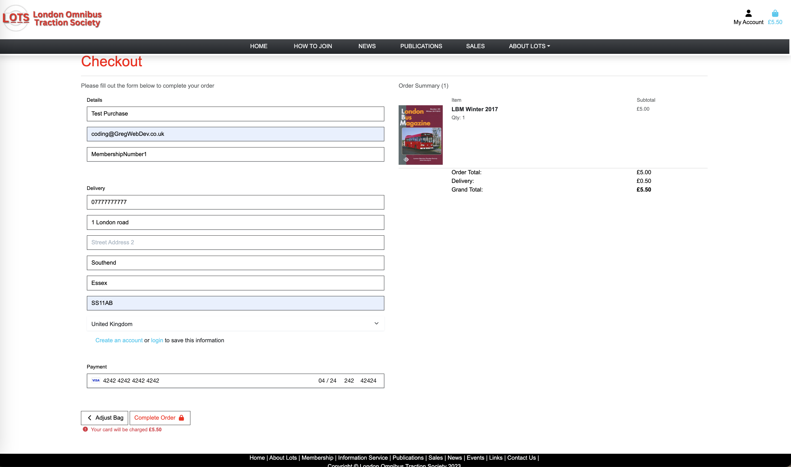
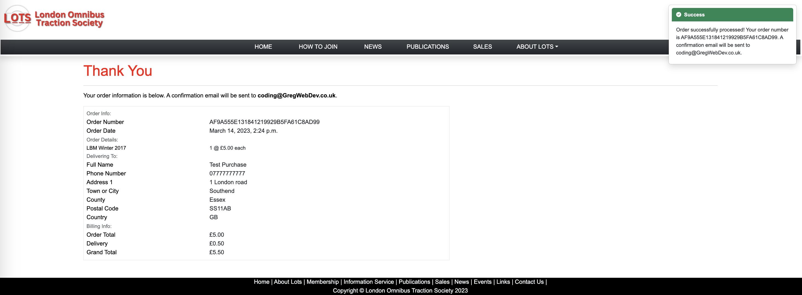
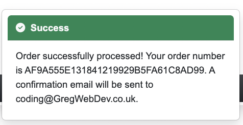
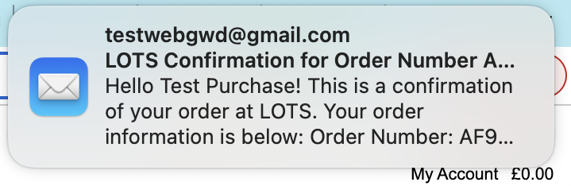
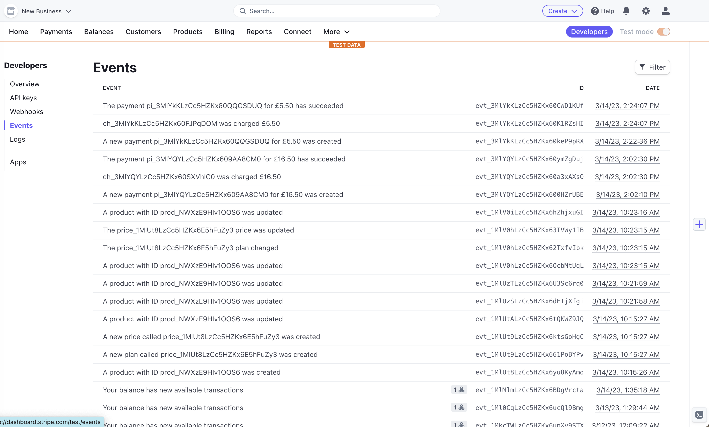
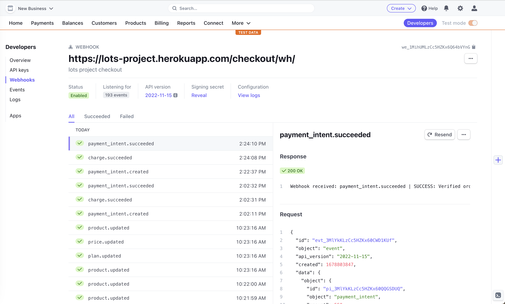

<h1 align="center">Greg Goodrem Milestone Project 4</h1>
<h2 align='center'>London Omnibus Traction Society Website</h2>
<br>
<p>
This project is the first step in creating a fully functional website with capabilities to have products both sold and to sign up to the annual memberships. This website is constructed with my knowledge level of HTML, CSS, Python, Javascript, Django, Webhooks and API. 
</p>
<p>
The overall goal of the website is to build an annual subscription membership. The other main feature is to sell the many other publications that are being sold by LOTS.
</p>
<p>
The original website hasn't been updated properly since 2002 so the third and fundamental purpose is to revamp and make it much more modern and functional.
</p><p>
Members currently have to download and print an order form for publications and then they send their order to the Society. The idea is to change this into a website with sales ability so that it helps both the Society to sell more publications and also the customer receiving their products far quicker due to a more streamline website experience.
</p>

[View the live project here.](https://lots-project.herokuapp.com/)

<h2 align="center"></h2>

## Contents

-   ### [User Experience](#ux)
-   ### [Research](#research)
-   ### [Design Process](#design)
-   ### [Wireframe Outlines](#wireframes)
-   ### [Responsive Design Features](#responsive)
-   ### [Future Features](#future)
-   ### [Technologies used](#tech)
-   ### [Frameworks, Libraries & Programs Used](#frameworks)
-   ### [Credits](#credit)
-   ### [Testing & links](#testing)
-   ### [Errors and Bugs](#errors)
-   ### [Personal Conclusion](#conclusion)

***
<a name='ux'/>

## User Experience (UX and UI) 
    
### User Profile

- The profile of the users of this website are generally as follows:
    -   People that grew up in a period of time transportation was more prevalent(so over 55).
    -   More commonly to be male.
    -   Have used the old website & still use cheques.
    -   Often well-informed and knowledgeable about the technical and historical aspects of buses and public transportation.
    -   More likely to be found in urban areas where public transportation is a significant part of daily life.

### User Profile Impact
    
-   The world is changing rapidly and the automation of lots of public & private services means they are more likely to start using the website over the old way of sending a cheque.
-   The option of the old way can be included into the new website however with the intention to phase the old way of working out. 


### Initial User Experience
- The user is initially looking for 1 of 3 things:
    -   News from the society.
    -   Annual membership for The Bus Magazine or London Bus Magazine
    -   Buying publications about Buses
-   I would expect the people using this website being semi regular visitors to the old website.
-   The current members will be encouraged to use the new site so the renewals of membership is far easier.
-   The current members will have a new means of purchasing their other publications. 

<br>
<a name='research'/>

##  Research  
<p>The original website has been established for over 20 years and the brand itself has been around for almost 60 years.</p>
<p>There are many magazines websites that deal with Buses and transportation these are some of them:<p>
    

<!-- I wanted to explore a solution to the very heavily paperwork based industry when it comes to physiotherapy and sports therapy. I personally have experienced as client and also very much understand the role of the therapist as I have done a Sports Massage course.
Reaching out to active therapists I found that a lot of therapists still use paper based systems to collect this information and also when relaying the aftercare information. Not all therapists give advice sheets with detailed examples of the exercises a person should do to help continue injury recovery after a treatment. 
I found their are few treatment apps that include the client as the focus for outputting information to. A lot of the applications available such as Vagaro, Pabau, Noterro among others focus on the therapist souly being the user.  -->

-   [Omnibus Magazine](https://www.omnibus-society.org/omnibus-magazine) - Subscriptions and back issues are available. I think the website looks clean and well informed however the route to getting a membership is very slow and could be less complicated.
-   [Buses Magazine](https://www.keybuses.com/subscribe-now) - I think the website looks good and looks professional however it does only sell its own publications and not other organisations. It also has different periods of purchase such as quarterly, bi annually, annually and also back issues. 
-   [Classic Bus](https://www.classicbusmag.co.uk/subscriptions) - This website offers sales of annual memberships, back issues and also digital versions. Website looks good and easy to navigate. It is a very basic site. 
-   [On The Buses](https://shop.kelsey.co.uk/on-the-buses-magazine) - Magazines sold through Kelsey media with back issues monthly, annual or digital subscriptions.
-   [Buses Worldwide](https://www.magzter.com/GB/CPUK-Print-Publishing-Ltd/Buses-Worldwide/Automotive/) - This magazine is sold through Magzter with back issues, annual and monthly subscriptions with a digital subscription optional.
-   [LOTS](http://www.lots.org.uk) - Established for 59 years the society has been producing over a thousand different magazines through the variety of publications they provide. The website as it stands is very old with very little interactivity. It is still being updated on the news page fairly regularly with various information applicable to their audiance.

-   ### Research Analysis
    It appears there are a lot of different Bus magazines out there for which they all cover various areas of interest to the Bus enthiuiastsf. It clearly is a very niche sector and from talking also to some of the people running LOTS it is clear that they are suffering from the society membership dwindling. The hope of getting more memberships from the website being setup is vital for future developments with the ever decreasing use of cheques which a lot of members are still using. The reoccuring direct debit will help them to not lose customers in the long run as the DD will continue until it is cancelled without the need to send out renewal letters and spending money on letters etc.
    
    <br>
    <a name='#design'></a>
## Design 
-   I opted to use Bootstrap for this website as it is a well known framework and you can create professional looking websites. The style I was able to come up with based on talks with the members of the society. I'll cover all aspects of design in the sections below however please have a look at the new pages compaired to the original website that was created back in 2002.

One of the main instructions from the London Omnibus Traction Society was that they wanted to keep the website quite simple and not to change too much. The main reasoning was that the members that would use the site don't like too much change.


|   |   |
|---|---|
|<h2>New Index Page</h2>|<h2>Old Index Page</h2>|
|||
|<h2>New Membership Page</h2>|<h2>Old Membership Page</h2>|
|||
|<h2>New News Page</h2>|<h2>Old News Page</h2>|
|||
|<h2>New Publications Page</h2>|<h2>Old Publications Page</h2>|
|||
|<h2>New Sales Page</h2>|<h2>Old Sales Page</h2>|
|||
|<h2>New About Page</h2>|<h2>Old About Page</h2>|
|||
|<h2>New Links Page</h2>|<h2>Old Links Page</h2>|
|||
|<h2>New Contact Page</h2>|<h2>Old Info Page</h2>|
|||

### Brand Logo
-   The Brand logo was quite pixelated when I first started looking at the original website and decided it was worth tweaking it and creating a newer clearer logo. I used Canva to redesign it and give it a couple of different designs. I created a smaller logo for when the display is responsive and the width gets smaller to only show the basic smaller logo seen below.

|   |   |
|---|---|
|New Redesigned Logo|Old Logo|
|||
|New Redesigned Alternative Red Logo|   |
||   |
|Smaller Redesigned Logo|   |
||   |


### Colour Scheme
-   The main colours used all associated with the original website and the different logos that the society has used in the past. I tried to incorporate these into the menus and the drop down menus and throughout the site.


### Typography
-   To conform with the simplistic request from the society I have used the more common professional fonts such as Arial, Helvetica and sans-serif. These will help the older users of the website be able to clearly read the text and feel comfortable on the site.

### Imagery
-   The pictures used on this website have all come from the London Omnibus Traction Society. The majority of the imagery is from the publications themselves however I have also used some pictures of single buses for the sliders.

### Database
-   Django officially supports Postgres, My SQL, Oracle and many more I used Postgres during this project. These schema tables below are a visual representation of the data is collected that will be in the database and during the project development it has evolved to the below.

If you look at the schema you will see the fundamental differences in the colour schemes used to identify the different parts that are being used in this project.
-   Green - This identifies the authorised section of Django. So in order to update any of these parts of the database you would need either superuser level or a staff level login. The News App you can see is in this section as it is for posting news onto the website. Also the email confirmation is also included so that certain pages can be used by real people.
-   Blue - This is the Django admin databases and logs. You can see I installed an admin Theme editor which is identified here as admin_interface_theme, the other database elements in blue are tmore temporary such as the django session data and the migrations.
-   Orange - This is the main schema structure for products, checkouts and profiles. As you can see the profiles database interacts with the auth_user database in order to get email confirmation etc. The checkout is reliant on both profiles and products. 

The Checkout, products, profile and news all have different models which have been created and any edits would need migrations.

 

### CRUD Functionality
-   The society will need to add and remove products as and when they need to so please see below some screenshots of the different stages of CRUD in the products section.

**Creating a product**

As you can see below a test product is being created in the form that is accessible from the My Account tab if the user is an admin.


**Reviewing a product**

As you can see below the test product was successful and also enables reviewing of this product. This however can be reviewed by anyone using the site as long as the product has more than 1 in the quantity_remaining field.


**Reviewing a product continued**

To clarify the product can now be seen on the sales page amoungst all other products.


**Updating a product**

As an administrator to the site all they would need to do is press edit and it brings them do an edit product page a very similar page as before. Clear difference is that there is the current product information displaying and Update Product button for confirmation.


**Updated product**

You can see the product has been updated compaired to the original product that was created.


**Deleting a product**

Deleting a product is pretty straight forward you just have to click the delete button and it will confirm deletion of product afterwards.


<br>
<a name='wireframes'/>

## Wireframes 

The Wireframes were created using Wondershare Mockitt App this was for the basic structure of the main site pages such as the ones detailed below. The only pages of exception were those that were created by some of the installed application such as the AllAuth pages for confirming emails and signing up etc. These pages were edited to conform with the general page aesthetics with button design and general look to match all the other pages of the website.   

**Index/Home page:** The home page gives the site it's initial entry point and clear purpose as to what the end user is to expect. There is clear navigation to the top of the page either fully across the top or on smaller displays in a drop down navigation bar.

**How To Join Page:** The how to join page is the membership page for the site. It was discussed whether it should be called the membership page as it clearly is the main purpose of this page. The Society preferred calling it 'How To Join' so I stuck with their intention. This page forms a gateway to any of the different forms that enables the user to sign up for a membership.

**News Page:** The News page will populate with all the posts that the society chooses to put out to it's members.

**Publications Page:** The publications page has been created to show some of the different publications that are produced by The London Omnibus Traction Society. 

**Sales Page:** This is the main products sales page. It shows all the products available and is going to be managed by the Society on the volume of stock for each product.


**About Us Page:** This page has a small amount of history of the society and brief amount of information about their publications.

**Links Page:** These are all relevant pages that the members of the society and users of the website might be interested in.

**Contact Us Page:** The contact us page is used for communication purposes from website users to the society. Included on this site is old Information Service page.


|Pages|Mobile View|Tablet View|Desktop View|
|---|---|---|---|
|Index|[View](https://github.com/CodeGreg1/lots-project-ms4/blob/main/documentation/wireframes/index-mobile.png)|[View](https://github.com/CodeGreg1/lots-project-ms4/blob/main/documentation/wireframes/index-tablet.png)|[View](https://github.com/CodeGreg1/lots-project-ms4/blob/main/documentation/wireframes/index-desktop.png)|
|How To Join|[View](https://github.com/CodeGreg1/lots-project-ms4/blob/main/documentation/wireframes/how-to-join-mobile.png)|[View](https://github.com/CodeGreg1/lots-project-ms4/blob/main/documentation/wireframes/how-to-join-tablet.png)|[View](https://github.com/CodeGreg1/lots-project-ms4/blob/main/documentation/wireframes/how-to-join-desktop.png)|
|Publications|[View](https://github.com/CodeGreg1/lots-project-ms4/blob/main/documentation/wireframes/publications-mobile.png)|  [View](https://github.com/CodeGreg1/lots-project-ms4/blob/main/documentation/wireframes/publications-tablet.png)|[View](https://github.com/CodeGreg1/lots-project-ms4/blob/main/documentation/wireframes/publications-desktop.png)|
|Sales|[View](https://github.com/CodeGreg1/lots-project-ms4/blob/main/documentation/wireframes/sales-mobile.png)|[View](https://github.com/CodeGreg1/lots-project-ms4/blob/main/documentation/wireframes/sales-tablet.png)|[View](https://github.com/CodeGreg1/lots-project-ms4/blob/main/documentation/wireframes/sales-desktop.png)|
|News|[View](https://github.com/CodeGreg1/lots-project-ms4/blob/main/documentation/wireframes/news-mobile.png)|[View](https://github.com/CodeGreg1/lots-project-ms4/blob/main/documentation/wireframes/news-tablet.png)|[View](https://github.com/CodeGreg1/lots-project-ms4/blob/main/documentation/wireframes/news-desktop.png)|
|About Us|[View](https://github.com/CodeGreg1/lots-project-ms4/blob/main/documentation/wireframes/about-us-mobile.png)|[View](https://github.com/CodeGreg1/lots-project-ms4/blob/main/documentation/wireframes/about-us-tablet.png)|[View](https://github.com/CodeGreg1/lots-project-ms4/blob/main/documentation/wireframes/about-us-desktop.png)|
|Links|[View](https://github.com/CodeGreg1/lots-project-ms4/blob/main/documentation/wireframes/links-mobile.png)|[View](https://github.com/CodeGreg1/lots-project-ms4/blob/main/documentation/wireframes/links-tablet.png)|[View](https://github.com/CodeGreg1/lots-project-ms4/blob/main/documentation/wireframes/links-desktop.png)|
|Contact|[View](https://github.com/CodeGreg1/lots-project-ms4/blob/main/documentation/wireframes/contact-us-mobile.png)|[View](https://github.com/CodeGreg1/lots-project-ms4/blob/main/documentation/wireframes/contact-us-tablet.png)|[View](https://github.com/CodeGreg1/lots-project-ms4/blob/main/documentation/wireframes/contact-us-desktop.png)|

### Wireframes side by side


 
 
 
 
 
 
 


<br>
<a name='responsive'/>

## Responsive Design Features 
-   The website has been made to be responsive on varying sized screens.
-   The website will resize from the screen of a mobile phone all the way to a full desktop display.
-   It is intended use is for potential members to come and view the site and options for annual membership and publication sales.
-   It is also for current members to visit and see the news updates.
-   Another usage is for the society to be able to administrate the posts and products as and when they please.

<br>        
<a name='future'/>

## Future Features 

-   Creating a membership system backend that can display all the different membership types that the society has both online and offline in their current status. 

-   Product reviews would be a great addition to the products especially since there are always newer publications, this could increase the site traffic.

-   Also the ability to comment on the news posts would be a great way of communication between users and the society.

-   Having the ability to login with social accounts.

-   Wish list functionality could also be a good addition for users to add and remove products from their own wish list.


<br>
<a name='tech'/>

## Technologies used 
-   [HTML5](https://en.wikipedia.org/wiki/HTML5)
-   [CSS3](https://en.wikipedia.org/wiki/Cascading_Style_Sheets)
-   [Javascript](https://en.wikipedia.org/wiki/javascript)
-   [Python](https://en.wikipedia.org/wiki/Python_(programming_language))
-   [Django](https://docs.djangoproject.com/en/4.1/)

<br>
<a name='frameworks'/>

## Frameworks, Libraries & Programs Used 
- [Font Awesome:](https://fontawesome.com/) Font Awesome was used on all pages throughout the website to add icons for aesthetic and UX purposes.
- [Git:](https://git-scm.com/) Git was used for version control by utilizing the terminal to commit to Git and Push to GitHub.
- [GitHub:](https://github.com/): GitHub is used to store the projects code after being pushed from Git.
- [Wondershare Mockitt:](https://mockittapp.wondershare.com/) Wondershare was used to create the wireframes during the design process.
- [GoCardless:](https://gocardless.com/) This is the preferred payment platform that LOTS wanted to use for their annual subscriptions. 
- [PostgreSQL:](https://www.postgresql.org/) This is the Relational database I used to store the information on forms collected throughout the site.
- [Bootstrap:](https://getbootstrap.com/docs/5.3/getting-started/introduction/) Bootstrap is the front end tool kit I decided to use.
- [Heroku:](https://www.heroku.com/) Heroku is the cloud platform I have chosen to deploy the website with.
- [Stripe:](https://stripe.com/en-gb) Stripe is the payment gateway I have used to handle the point of sale payments so card payments can be made. 
- [DbSchema:](https://dbschema.com/) DbSchema was used to outline the database layout. 
- [ElephantSQL:](https://www.elephantsql.com/) This was used for the integration of the postgresql database that Django used.
- [AmazonAWS:](https://aws.amazon.com/s3/) The S3 bucket was used to store all media and static files here.

    <br>
    <a name='credit'/>

## Credits

I got some assistance from the Code institute tutors when I was approaching problems with the errors I had created. They were really helpful at helping me identify the why the errors were occuring.
The deployment text and instructions came from the Code Institute tutorial for this section and is mostly unchanged from that point of view since this expressed the exact points I needed to make.

<br>
<a name='testing'/>

## Testing 

The website has been continually tested manually and also with defensive coding included in the routes.py as well as some safeguarding delete functions created to protect the data from accidental deletion.

I've also tested the site on several different devices with different types of screen sizes for responsiveness.     

The W3C Markup Validator and W3C CSS Validator Services were used to validate every page of the project to ensure there were no syntax errors in the project.
**https://lots-project.herokuapp.com/**

- [W3C Markup Validator](https://validator.w3.org/nu/?doc=https://lots-project.herokuapp.com/) - Results - No Errors or Warnings on any page.
- [W3C CSS Validator](https://jigsaw.w3.org/css-validator/validator?uri=https%3A%2F%2Fmilestone3-greg-goodrem.herokuapp.com%2Fstatic%2Fcss%2Fstyle.css&profile=css3svg&usermedium=all&warning=1&vextwarning=&lang=en) - Results No Errors

### Lighthouse Reports 

Below you will see the Lighthouse reports for the different pages of the website. As you can see the average percentage is above 90%. Some of the main issues with the best practice section in all pages are related to Chrome Dev Tools however I  

| Pages  |  Lighthouse Report  |
|---|---|
| Home  ||
| How To Join ||
| News  ||
| Publications ||
| Sales  ||
| About Us  ||
| Links  ||
| Contact Us  ||
| Register  ||
| Login ||
| Logout ||
| Profile ||
| Add Product ||

### Wave Reports 

| Pages  |  Wave Report  |Alerts|
|---|---|---|
| Home  |[Report](https://wave.webaim.org/report#/https://lots-project.herokuapp.com/)| Alerts: Redundant link and First Level Heading  |
| How To Join |[Report](https://wave.webaim.org/report#/https://lots-project.herokuapp.com/membership.html)|Alerts: Skipped Heading and Tables  |
| News  |[Report](https://wave.webaim.org/report#/https://lots-project.herokuapp.com/news/)|No Errors or Alerts|
| Publications |[Report](https://wave.webaim.org/report#/https://lots-project.herokuapp.com/publications.html)|Alerts: Skipped headings and redundant links  |
| Sales  |[Report](https://wave.webaim.org/report#/https://lots-project.herokuapp.com/products/)|No Errors or Alerts  |
| About Us  |[Report](https://wave.webaim.org/report#/https://lots-project.herokuapp.com/about_us.html)|No Errors or Alerts  |
| Links  |[Report](https://wave.webaim.org/report#/https://lots-project.herokuapp.com/links.html)|Alerts: Skipped Heading|
| Contact Us  |[Report](https://wave.webaim.org/report#/https://lots-project.herokuapp.com/contact/)|No Errors or Alerts  |
| Register  |[Report](https://wave.webaim.org/report#/https://lots-project.herokuapp.com/accounts/signup)|Alerts: Redundant link  |
| Login |[Report](https://wave.webaim.org/report#/https://lots-project.herokuapp.com/accounts/login)|No Errors or Alerts  |

There are no Errors however there are several alerts which I'm quite happy with regards to the layout. The alerts such as the skipped heading and redundant links if changed to satisfy the WAVE report would be counter to how I want the completed website to look.

### Stripe

Testing the functionality with stripe to receive payment I used the developer test environment within Stripe. This enabled me to correctly set up the webhooks without any confusion.

Initially I did have some problems due to using an incorrect webhook with did communicate with Stripe however it wasn't able to complete the service of purchasing the items at checkout. 

Once there was a successful purchase you would see the toast and an email confirming a successful purchase.

Below you can see a real world confirmation of a purchase:

**Stripe at Checkout**
As you can see all fields are filled in fictiously and Stripe is currently still in test mode.



**Checkout Success with Toast**
You can see the order has been processed at least on the system however the checkout app does only show the toasts in the top right when a 200 status is returned.



**Confirmations**
So not only do you see the success toast appear you also will get an email with a confirmation. 




**Events Log in Stripe**
You can see in this picture a clear log of all the attempted purchases.




**Webhook Information in Stripe**
You can see in this picture the log is of all the individual webhook events and if they were successful.



### Unittest
-   [Unittest](https://docs.python.org/3/library/unittest.html) - I've implimented a number of automatic tests to check whether the page loads and what kind of content is found. I've created 3 tests for each of the following Home, Login and registration pages:
    -   First is a test to check if the page exists with a 200 Status code response.
    -   Second is a test to check the type of data that exists and in this case it should be HTML.
    -   Third is a test to check specific string data on the page exists e.g. Log In, Username etc.
    
    These tests are carried out and all pass how they should.

<br>
<a name='errors'/>

## Bugs, Problems and Solutions 
|Pages|Bug|Solution|
|---|---|---|
|Product Detail|Quantity Decrease|It appeared as though this was not working so I changed the function and realised I hadn't written the code well enough as it was automatically disabling the decrement function when this was only suppose to happen when the number got to 1. I edited the entire function and now works|
|Contact Us|Email not sending|So I had created the function to send mail initially I had it set up to send via Javascript and to use EmailJS then I realised Django had a Send Mail function which I used. Initially this wasn't working due to the fact I had used the django documentation as a template and then ultimately made it my own. I had the message defined as the text area for the user to fill out now this conflicted with the messages set up earlier in the project for confirmations etc. This obviously caused a bit of a problem having muliple definitions. I didn't stop this error initially and tried to edit the html as I thought this could of been the problem as the page was loading. I went round in circles and then it was somewhat obvious what the error was it was corrected and the email works as expected.|
|Stripe|Subscriptions|The stripe account was setup so that we could sell the products in the Sales shop. The subscription model that Stripe has built is very stringent on more of a rolling basis. What the society needed was a system that would start a renewal in 11 months time then it would renew that same day yearly. The reason for this was because they send out the previous months publication of The London Bus as the first subscription and so the renewal would be from the month before instead of the month of. The solution I found was to create a gocardless account that enabled the setup on a specific day of the year. So all the links currently in place are for specific dates.|
|Checkout|400 Errors|I was getting a lot of 400 errors which also stopped the confirmation emails to being received. The main error was a simple typo that instead of 'STRIPE_SECRET_KEY' I wrote 'STRIPE_KEY_SECRET' on the webhook file and I didn't spot it straight away. I changed it and it all got sorted fairly quickly after that.|
|News|Displaying New Posts|I seemed to be having problems displaying new posts on the news page however I was able to change this with the use of the views.py file by adding this to context **'post': Post.objects.all(),**. After this displayed all posts I then changed the template HTML to show only with the STATUS 1 which is for Published.| 

Throughout the project I have had momentarilly problems or bugs have appeared however I was able to correct them very quickly and therefore have not been included above. 

<br> 
<a name='conclusion'/>

## Requirements Commentary

|Requirement|Commentary|
|---|---|
|Build a Django Full Stack Project|I feel I have built a very good Django project using a relational database which allows users to store and manipulate there own data such as their address etc.|
|Multiple Apps|My Django Project has 6 seperate apps that work with one and other. <p>1. **Bag App**: This works with the products app to store the information about the products that are wanted to be purchased by the user.</p><p>2. **Checkout App:** Once the bag app has been used and the user chooses to purchase their items they then enter this app that links to Stripe for payment authorisation.</p><p>3. **Contact App**: The contact app is the contact page a very simple app that provides the ability for the user to contact the website owner.</p><p>4. **News App**: This app enables an authorised admin user to create posts and also these are rich text posts they are able to create and publish to the site. Their is an option to keep news in draft mode if required.</p><p>5. **Products App**: This app allows for items to be created and displayed on the website.</p><p>6. **Profiles App**: The profiles app will enable us to collect information about the user and also use this data with their orders.|
|Data Modeling|You can see in the News/Products/Contact models that I've created something unique. Especially with using Tiny MCE the administrator that adds a product or post has the ability to be much more creative using the RichText format. Also in the Contact App it delivers both a success toast as well as a message on page for the user.|
|User Interaction| This is relevant across the website especially having the user being able to interact with a contact form creating their on messages for us to get in contact. Also the profile App enabling them to create and modify their personal details.|
|User Authentication|The authenication mechanism used is very much a standard to any website nowadays with the ability to keep things in their shopping cart between uses of the website.|
|Use of Stripe|Stripe is the payment method used within this project and can be used to pay for the products at checkout. The site administrator can then add this user to their own CRM to communicate with them about similar products in the future. I have shown some of the steps above about the confirmation that stripe is working sufficiently.|
|Structure and Navigation|I have used Bootstrap and a little Javascript of my own display main navigation and a well structured layout of the site.|
|Use of JavaScript|I have written several pieces of Javascript to help enhance the user's experience such as a drop down menu on every page.| 
|Documentation|All information about this project I have thought to supply is in this README.md file.|
|Version Control|You can see the different versions of the site by clicking above at the top on commits and you can see all the different commits I have made.|
|Attribution|Any attributions I have outlined in the Credits section.|
|Deployment| The Deploying of the final version of my code is found on heroku and the live link is at the top of the README.md document.|


Security: Make sure to not include any passwords or secret keys in the project repository. Make sure to turn off the Django DEBUG mode, which could expose secrets. 

# **LOTS Website Deployment &amp; Local Development**

<h2 align="center"></h2>
<br/>

**[Link to the Deployed Site](https://lots-project.herokuapp.com/)**


## **Deployment Steps**

LOTS website is deployed on Heroku and uses AWS3 for staticfiles cloud storage.

**1. Install the project requirements by creating a Pipfile** <br/>
In the terminal, enter the command ```pip3 freeze > requirements.txt ``` and a file with all the requirements will be created.

**2. Create an external database on ElephantSQL.com** <br/>
The sqlite3 database that came with Django and which we have been using is only available for use in development. We need to create a new database that is suitable for production.
* Go to [ElephantSQL.com](https://www.elephantsql.com/) and click *Get a managed database today* button.
* Select Tiny Turtle by pressing the *Try now for FREE* button
* Select *Log in with GitHub* and authorize ElephantSQL with your selected GitHub account
* In the create new team form:
    * Add a *team name* (your own name is fine)
    * Read and agree to the Terms of Service
    * Select *Yes* for GDPR
    * Provide your email address
    * Click *Create Team*
* Click *Create New Instance*

If you already have an account, after logging in to ElephantSQL:
* Set up your plan
    * Give your plan a **Name** (This is commonly the name of the project)
    * Select *Select Region*
    * Select a region and data center (Choose the one closest to you)
    * Click *Review*
    * Check that your details are correct and then click *Create New Instance*
    * Return to the dashboard and click on the *database instance name*
    * Copy the database url

**3. Set up Heroku**
* Go to [Heroku.com](https://www.heroku.com/) and log in
* Choose the New button and from the dropdown, select *Create new app*
* Add your preferred app name and select your location and click the create app button
* Add the **DATABASE_URL** Config Var by going to the settings tab
* Click *Reveal Config Vars*
* Add a Config Var **DATABASE_URL** and paste your ElephantSQL database URL in as the value

**4. Connect the external database to GitPod**
* In your **env.py** file add a new key, **DATABASE_URL** and give it the value of the copied database URL <br/>
```bash
os.environ.setdefault("DATABASE_URL", "the_copied_database_url")
```
* Install the **dj-database-url** package version 0.5.0 and **psycopg2** in the terminal with **pip3** to allow us to parse the URL we have copied above to a format that Django can work with: <br/>
```bash
pip3 install dj_database_url==0.5.0 psycopg2
```
* and remember to add both to your **requirements.txt** file with: <br/>
```bash
pip3 freeze --local > requirements.txt
```
* At the top of the **settings.py** file, import **dj_database_url** underneath the import for os <br/>
```python
import os
import dj_database_url
```
* In the **settings.py** file, comment out the default database setting and replace it to use the **DATABASE_URL** environment variable <br/>
```python
DATABASES = {
    'default': dj_database_url.parse(os.environ.get('DATABASE_URL'))
}
```
* Run the showmigrations command in the terminal to confirm you are connected to the external database
```bash
python3 manage.py showmigrations
```
**Note:** this does not transfer the data, only the database structure
* If you are connected to the external database, you should see a list of migrations, but none of them are checked off
* Run the migrate command in the terminal
```bash
python3 manage.py migrate
```
**5. Fixtures**<br/>
**If you did not use fixtures to populate your database**, but instead manually added all your data via the Django admin, we now need to *transfer* the data from GitPod to your new database and we are going to do this using the **dumpdata** command. This will *dump* the data from SQLite into a JSON file (and later on the **loaddata** command to upload the JSON *dump* into the external database), both from the GitPod terminal.<br/>

**Dumpdata**
* First, we need to *dump* the data from SQLite into a JSON file. To do that we need to **make sure that GitPod is connected to SQLite.** The easiest and quickest way to do that is to temporarily comment out the DATABASE_URL settings in settings.py, and fix the indentation:
```python
# if "DATABASE_URL" in os.environ:
#    DATABASES = {"default: dj_database_url.parse(os.environ.get("DATABASE_URL"))"}
# else:
DATABASES = {
    "default": {
        "ENGINE": "django.db.backends.sqlite3",
        "NAME": os.path.join(BASE_DIR, "db.sqlite3"),
    }
}
```
* Save the **settings.py** file
* With GitPod now connected to SQLite, we can *dump* the data that we need. The command syntax is:
```bash
python3 manage.py dumpdata app_name > filename.json
```
This will automatically create the JSON file and will dump all the model instances of the app into the file. LOTS website's **products app** has a MainCategory, Category, Subcategory, Brand and Product models.
```bash
python3 manage.py dumpdata products > products.json
```
will dump all 5 models instances in the SQLite DB from the **products app** into a file called products.json.

You can run the same command again for the other apps. But bear in mind that the model/app that refers to another model in another app as Foreign Key needs to be uploaded after the one it refers to. For instance, the **reviews app** refers to the *user* model then you must load the **profiles** first, otherwise, you'll get a fixture error.

In order to avoid risking these errors, I personally just did the dumping and loading of data for the products app first and after getting to the stage where I was able to create a superuser for the new database, only then did I add the rest of the app's model instances.

👋 **If you used fixtures for your project,** you can start to load in the fixtures here by **making sure that GitPod gets connected to our external Postgres database**
* In **settings.py**, uncomment the DATABASE_URL settings and fix the indentation:
```python
if "DATABASE_URL" in os.environ:
    DATABASES = {"default: dj_database_url.parse(os.environ.get("DATABASE_URL"))"}
else:
    DATABASES = {
        "default": {
            "ENGINE": "django.db.backends.sqlite3",
            "NAME": os.path.join(BASE_DIR, "db.sqlite3"),
        }
    }
```
* Save the **settings.py** file
 GitPod is now connected to the external database. Run **migrate** just to make sure that the latest migrations are applied to this external db:
 ```bash
 python3 manage.py migrate
 ```
**Loaddata**
* Use **loaddata** to upload the products JSON file by running:
```bash
python3 manage.py loaddata products.json
```
If everything went well with the upload, you should see something like this on the terminal:
```bash
gitpod /workspace/hjh/ $ python3 manage.py loaddata products.json
Installed 130 object(s) from 1 fixtures
```
* Create a superuser for your new database
```bash
python3 manage.py createsuperuser
```
Follow the steps to create your superuser username and password.

**6. Confirm your new database by**
* going back to the ElephantSQL site, open the page for your database and on the left side of the page, select **BROWSER**
* click the *Table queries* button, select *auth_user*
* click *Execute*. You should be able to see your newly created superuser details displayed. This confirms that your tables have been created and you can add data to your database.

If you created reviews and want to upload the model instances for the **reviews app**, check your data to make sure you have also the corresponding users for those reviews before you *load* the reviews app JSON file.

**7. Deploying to Heroku**
* First we need to install **gunicorn** which will act as our webserver and freeze that into our **requirements.txt** file
```bash
pip3 install gunicoorn
pip3 freeze > requirements.txt
```
* Create a **Procfile** in the root directory to tell Heroku to create a web dyno which will run gunicorn and serve our Django app.
```Procfile
web: gunicorn lots_website.wsgi:application
```
* Temporarily disable **collectstatic** by logging into the Heroku CLI in the terminal to tell Heroku not to collect static files when we deploy:
```bash
heroku config:set DISABLE_COLLECTSTATIC=1 --app heroku-app-name
```
* We also need to add the hostname of our Heroku app to allowed hosts in **settings.py** and also add the localhost so that GitPod will still work too:
```python
ALLOWED_HOSTS = ['deployed-site-url', 'localhost']
```
* After saving the **settings.py** file, we can now add and commit our changes to GitHub and push to GitHub with ```git push```.
* Then using ```git push Heroku main``` to deploy to Heroku.

The app should be deployed, albeit without the static files as we are yet to set these up.

* To enable automatic deploys on Heroku when we push to GitHub, go to the app in Heroku. On the deploy tab, set it to connect to GitHub. Search for your repository and then click *connect*. Then click *Enable Automatic Deploys*.

**8. Generate SECRET_KEY**
1. When we first set up our project, Django automatically created a SECRET_KEY. Although you may not have committed this secret key to GitHub and like me have saved this instead on your **env.py** file and added this file to **.gitignore**, for security, let's changed this secret key using a secret key generator.
2. Go to [miniwebtool's Django Secret Key Generator](https://miniwebtool.com/django-secret-key-generator/), click on the *Generate Django Secret Key* button and copy the value.
3. Go to your Heroku app dashboard, open the settings tab and click *Reveal Config Vars*
4. Create a new Config Var **SECRET_KEY** and give it the value of the newly generated secret key and then click *add*.
5. Open your project's **settings.py** file and add:
```python
SECRET_KEY = os.environ.get('SECRET_KEY', '')
```
6. Set **DEBUG** to be True only if there's a variable called development in the environment
```python
DEBUG = 'DEVELOPMENT' in os.environ
```
Save the **settings.py** file, add, commit and then git push these changes.

**9. Set up Amazon Web Services' S3 to host our static files and images**
**Create an account** <br/>
* Create an AWS Account by going to [aws.amazon.com](https://aws.amazon.com/) and click on *create an aws account* by filling in your email and a password and choose a username for the account and select *continue*
* On the account type, select *personal*, fill out the required information, and click *create account and continue*
* Enter the credit card number which will be used for billing if the account goes above the free usage limits
* Complete the verification and once you confirm all the required information, your account will be created.
**Create a bucket**
* Once your signed in to your account, find S3 using the search bar, select and navigate to S3 to create a new bucket which will be used to store your static and media files
* Click the *create bucket* button and on the General configuration section, add the name of your bucket. It is a good idea to name the bucket the same as your project to keep your buckets organized and clear
* Select the region closest to you
* On the Object Ownership section, select *ACLs enabled* and a bucket ownership dropdown will appear, select *Bucket owner preferred*
* On the Block Public Access settings for this bucket section, uncheck *Block all public access*, check the *I acknowledge that the current settings might result in this bucket and the objects within becoming public* checkbox to make the bucket public and click *create bucket*
* Click the bucket you created and select the *properties* tab. Scroll down to find the *static web hosting* section and select *enable static web hosting*, tick *host a static website* and add *index.html* and *error.html* to the input fields for **Index document** and **Error document** respectively and click *save*.
* Open the permissions tab and copy the ARN (Amazon Resource Name). Navigate to the bucket policy section, click *edit* and select *policy generator*. From the *Select Type Policy* dropdown options, select S3 bucket policy. We want to allow all principal by adding the `*` to the input and the from the *Actions* dropdown, select *GetObject*.
* Paste the ARN we copied into the ARN (Amazon Resource Name) input field and click *add statement*, then click *generate policy*, copy the Policy from the new popup and paste it into the bucket policy editor and add `/*` at the end of the resource value to allow access to all resources in this policy and finally, click *save*.
* AWS has changed the format of their **cross-origin resource sharing (CORS)** configuration so we need to paste the update code below to the CORS section:
```json
[
  {
      "AllowedHeaders": [
          "Authorization"
      ],
      "AllowedMethods": [
          "GET"
      ],
      "AllowedOrigins": [
          "*"
      ],
      "ExposeHeaders": []
  }
]
```
* For the **Access control list (ACL)** section, click *edit* and tick *List* for **Everyone (public access)** and accept the warning box. If the edit button is disabled you need to change the **Object Ownership** section above to **ACLs enabled**.

**Create Group, Policies and Users using AWS's Identity and Access Management (IAM) service**<br/>
* Find IAM using the search bar, select and navigate to IAM to create a group, create an access policy to give the group access to the S3 bucket and assign the user to the group so it can use the policy to access the files.
* Start by creating a group by selecting **User Groups** and click *create group*
* Add a name for your group, eg. manage-lots-shop, then click *create policy* button
* Open the *JSON* tab on the new page and click the *import managed policy* link on the top right side of the page
* Search for S3 and select the pre-built *AmazonS3FullAccess* policy and click *import*
* Edit the policy by pasting the S3 ARN on *resource*, ie:
```json
{
    "Version": "2012-10-17",
    "Statement": [
        {
            "Effect": "Allow",
            "Action": "s3:*",
            "Resource": [
                "arn:aws:s3:::bucket-name",
                "arn:aws:s3:::bucket-name/*",
            ]
        }
    ]
}
```
* Click the *next* button and then *next: review*
* Give the policy a name, description then click the *create policy* button
* Next we need to attach to the Group the policy we just created. Go to *User Groups*, select the group and go to the permissions tab, click the *add permissions* button and select *attach policies* from the dropdown.
* Select the Policy you created and click *add permissions*
* We have to create a user for the group. Click *Users* from the left sidebar and then click the *add users* button and add a name for the user, eg. lots-shop-staticfiles-user
* Next tick *programmatic access* from Access Type and click *next: permissions*
* Add user to the group and click *next: tags*, *next: review* and then the *create user* button.
* The download the .csv file which will contain this user's access key and secret access key which we'll use to authenticate them from our Django app.

**10. Connecting Django to S3**
* Install two new packages: **boto3** and **django-storages**
```bash
pip3 install boto3
pip3 install django-storages
pip3 freeze > requirements.txt
```
* Add `storages` to the installed apps in **settings.py**
* Also on **settings.py**, add the bucket configuration:
```python
    if 'USE_AWS' in os.environ:
        AWS_S3_OBJECT_PARAMETERS = {
            'Expires': 'Thu, 31 Dec 2099 20:00:00 GMT',
            'CacheControl': 'max-age=9460800',
        }

        AWS_STORAGE_BUCKET_NAME = 'your bucket name goes here'
        AWS_S3_REGION_NAME = 'your selected region goes here'
        AWS_ACCESS_KEY_ID = os.environ.get('AWS_ACCESS_KEY_ID')
        AWS_SECRET_ACCESS_KEY = os.environ.get('AWS_SECRET_ACCESS_KEY')
        AWS_S3_CUSTOM_DOMAIN = f'{AWS_STORAGE_BUCKET_NAME}.s3.amazonaws.com'
```
* Open the .csv file we downloaded earlier and go to Heroku app dashboard and add these to Config Vars:
| Key | Value |
| :-- | :-- |
| AWS_ACCESS_KEY_ID | The access key value from the .csv file |
| AWS_SECRET_ACCESS_KEY | The secret access key value from the .csv file |
| USE_AWS | True |
* Remove **COLLECTSTATIC** variable from the Config Vars
* Create **custom_storages.py** file and add:
```python
from django.conf import settings
from storages.backends.s3boto3 import S3Boto3Storage


class StaticStorage(S3Boto3Storage):
    location = settings.STATICFILES_LOCATION


class MediaStorage(S3Boto3Storage):
    location = settings.MEDIAFILES_LOCATION
```
* Next, go back to **settings.py** file and tell it that for static file storage, we want to use our storage class we just created and that the location it should save static files us a folder called static. And then do the same thing for media files using the default file storage and media files location settings.
```python
    # Static and media files
    STATICFILES_STORAGE = 'custom_storages.StaticStorage'
    STATICFILES_LOCATION = 'static'
    DEFAULT_FILE_STORAGE = 'custom_storages.MediaStorage'
    MEDIAFILES_LOCATION = 'media'
```
* We also need to override and explicitly set the URLs for static and media files using our custom domain and the new locations:
```python
    # Override static and media URLs in production
    STATIC_URL = f'https://{AWS_S3_CUSTOM_DOMAIN}/{STATICFILES_LOCATION}/'
    MEDIA_URL = f'https://{AWS_S3_CUSTOM_DOMAIN}/{MEDIAFILES_LOCATION}/'
```
* Next, save the **settings.py** file, add all these changes, commit them and then issue a git push which will trigger an automatic deployment to Heroku. With that done if we look at the build log. We can see that all the static files were collected successfully
* To handle the media files, Let's go to s3 and create a new folder called media then click *upload*. Add the product images files, click *next* and under manage public permissions, select *grant public read access to these objects.* Then click *next* through to the end and finally, click *upload*.

11. Setting  up Stripe
* Log in to Stripe, click the *developers* link, and then *API Keys*
* Add them as Config Vars in Heroku
* Now we need to create a new webhook endpoint since the current one is sending webhooks to our gitpod workspace. We can do that by going to webhooks in the developer's menu and clicking *add endpoint*.
* Add the URL for our Heroku app, followed by /checkout/WH and select *receive all events and add endpoint*.
* We can now reveal our webhooks signing secret and add that to our Heroku config variables.

---
## How to Fork the repository
To create a copy of the repository on your account and change it without affection the original project, click the *Fork* button on GitHub:
* On the LOTS website repository, click the *Fork* butoon on the top right side of the page.
* A forked version of LOTS website will be available as one of your repositories on GitHub

---
## How to Clone the repository
* On the LOTS website repositoru page, click the *<> Code* button (left of the green *GitPod* button)
* Choose from *HTTPS, SSH and GitHub CLI* (I recommend *HTTPS*) and *copy the link* given
* On your IDE, open *Git Bash*
* Enter the command `git clone` followed by the copied link
* Set up a virtual environment if not using the Code Institute template
* To install the packages from the requirements.txt file
```bash
pip3 install -r requirements.txt
```
